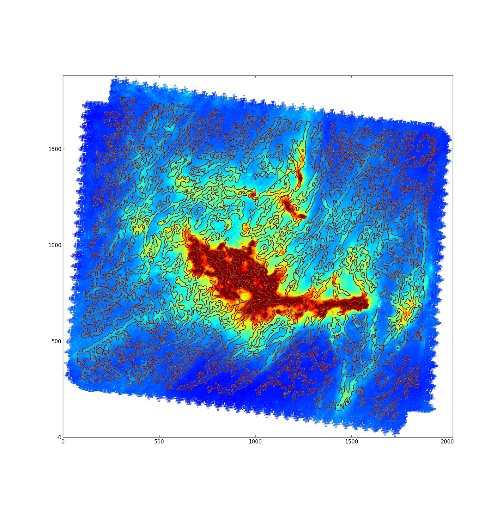
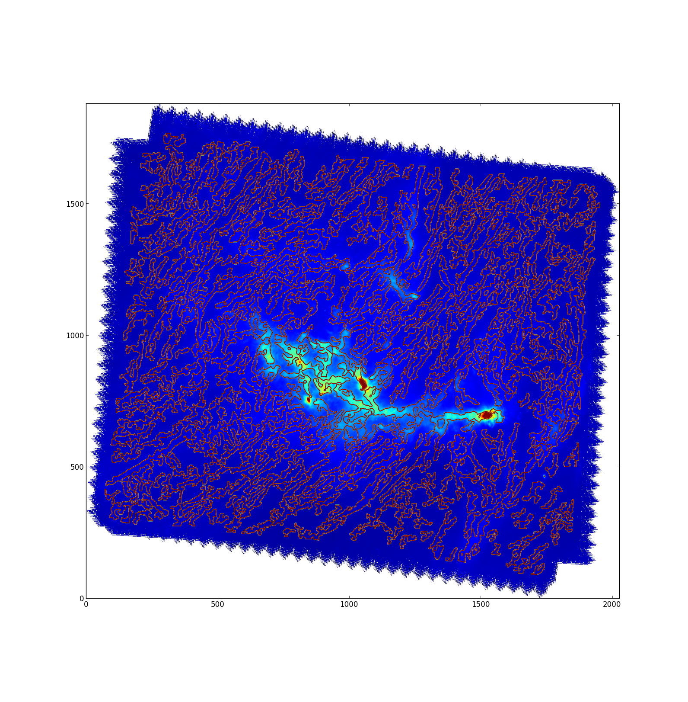

fil_finder
==========

Description
------------

fil_finder is a module for extraction and analysis of filamentary structure in molecular clouds.

fil_finder segments filamentary structure in an integrated intensity image using adaptive thresholding. Detected regions are reduced to a skeleton using a Medial Axis Transform. Pixels within each skeleton are classified by the number of connecting pixels. A pixel can be a body end, or intersection point. A shortest path algorithm finds the longest path through the skeleton, which is reported as the main length. At this point, branches less than a length threshold are removed to give a final skeleton. A Euclidean Distance Transform is performed to build a radial profile of each filament. A gaussian is fit to the profile to find the width, which is consequently converted to the FWHM value, and deconvolved with the FWHM beamwidth of the instrument. To describe the shape of the filament, we report its average curvature. This is done by randomly choosing three pixels on the skeleton and using the Menger Curvature Formula.

Example Images
--------------

Package Dependencies
--------------------

Requires:

 *   numpy 1.7.1
 *   matplotlib
 *   astropy
 *   scipy
 *   scikits-image 0.8.0
 *   networkx
 *   pandas

Optional: 

 * pygraphviz -- to make connectivity graphs (set verbose = True)
