Filament2D Tutorial
===================

This tutorial demonstrates the usage of the ``FilFinder2D`` object to
perform the analysis on an individual filament. The general tutorial for
FilFinder can be found
`here <http://fil-finder.readthedocs.io/en/latest/tutorial.html>`__.

.. code:: python

    %matplotlib inline
    import matplotlib.pyplot as plt
    import astropy.units as u

    # Optional settings for the plots. Comment out if needed.
    import seaborn as sb
    sb.set_context('poster')

    import matplotlib as mpl
    mpl.rcParams['figure.figsize'] = (12., 9.6)

The general tutorial demonstrates how the ``Filament2D`` objects
interact with ``FilFinder2D``. To generate an example, we will use a
straight Gaussian filament to demonstrate how the FilFinder analysis can
be run on individual filaments. We can also create a simplified mask by
simply thresholding the image.

.. code:: python

    from fil_finder import FilFinder2D, Filament2D
    from fil_finder.tests.testing_utils import generate_filament_model

    mod = generate_filament_model(return_hdu=True, pad_size=30, shape=150,
                                      width=10., background=0.1)[0]

    # Create a simple filament mask
    mask = mod.data > 0.5

    plt.imshow(mod.data, origin='lower')
    plt.colorbar()
    plt.contour(mask, colors='c', linestyles='--')

.. parsed-literal::

    <matplotlib.contour.QuadContourSet at 0x7f1578dea630>

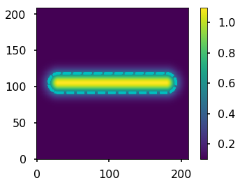

The simple filament model is shown above, with the mask highlighted by
the dashed contour.

The first step is to run the first few steps on the FilFinder algorithm
with ``FilFinder2D``:

.. code:: python

    filfind = FilFinder2D(mod, distance=250 * u.pc, mask=mask)
    filfind.preprocess_image(flatten_percent=85)

    filfind.create_mask(border_masking=True, verbose=False,
                        use_existing_mask=True)
    filfind.medskel(verbose=False)
    filfind.analyze_skeletons()

.. parsed-literal::

    /home/eric/Dropbox/code_development/filaments/build/lib.linux-x86_64-3.6/fil_finder/filfinder2D.py:288: UserWarning: Using inputted mask. Skipping creation of anew mask.
      warnings.warn("Using inputted mask. Skipping creation of a"

The ``Filament2D`` objects are created when running
``FilFinder2D.analyze_skeleton``. From here, we will focus on the
filament object:

.. code:: python

    fil = filfind.filaments[0]

The ``Filament2D`` object contains a minimized version of the FilFinder
algorithm. Most of the ``FilFinder2D`` functionality simply loops
throught the ``Filament2D`` objects. However, ``Filament2D`` object do
not keep a copy of the data and are designed to carry a minimal amount
of information.

Though not shown here, the only requirement to create a ``Filament2D``
object is a set of pixels that define the skeleton shape. These are
contained in:

.. code:: python

    fil.pixel_coords

.. parsed-literal::

    (array([105, 105, 105, 105, 105, 105, 105, 105, 105, 105, 105, 105, 105,
            105, 105, 105, 105, 105, 105, 105, 105, 105, 105, 105, 105, 105,
            105, 105, 105, 105, 105, 105, 105, 105, 105, 105, 105, 105, 105,
            105, 105, 105, 105, 105, 105, 105, 105, 105, 105, 105, 105, 105,
            105, 105, 105, 105, 105, 105, 105, 105, 105, 105, 105, 105, 105,
            105, 105, 105, 105, 105, 105, 105, 105, 105, 105, 105, 105, 105,
            105, 105, 105, 105, 105, 105, 105, 105, 105, 105, 105, 105, 105,
            105, 105, 105, 105, 105, 105, 105, 105, 105, 105, 105, 105, 105,
            105, 105, 105, 105, 105, 105, 105, 105, 105, 105, 105, 105, 105,
            105, 105, 105, 105, 105, 105, 105, 105, 105, 105, 105, 105, 105,
            105, 105, 105, 105, 105, 105, 105, 105, 105, 105, 105, 105, 105,
            105, 105, 105, 105, 105, 105, 105]),
     array([ 30,  31,  32,  33,  34,  35,  36,  37,  38,  39,  40,  41,  42,
             43,  44,  45,  46,  47,  48,  49,  50,  51,  52,  53,  54,  55,
             56,  57,  58,  59,  60,  61,  62,  63,  64,  65,  66,  67,  68,
             69,  70,  71,  72,  73,  74,  75,  76,  77,  78,  79,  80,  81,
             82,  83,  84,  85,  86,  87,  88,  89,  90,  91,  92,  93,  94,
             95,  96,  97,  98,  99, 100, 101, 102, 103, 104, 105, 106, 107,
            108, 109, 110, 111, 112, 113, 114, 115, 116, 117, 118, 119, 120,
            121, 122, 123, 124, 125, 126, 127, 128, 129, 130, 131, 132, 133,
            134, 135, 136, 137, 138, 139, 140, 141, 142, 143, 144, 145, 146,
            147, 148, 149, 150, 151, 152, 153, 154, 155, 156, 157, 158, 159,
            160, 161, 162, 163, 164, 165, 166, 167, 168, 169, 170, 171, 172,
            173, 174, 175, 176, 177, 178, 179]))

These pixel coordinates are the positions in the original image. When
the skeleton array is generated, the minimal shape is returned:

.. code:: python

    plt.imshow(fil.skeleton())

.. parsed-literal::

    <matplotlib.image.AxesImage at 0x7f157c3b3a90>

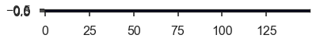

For a straight skeleton in this case, this returns a 1-pixel wide array
in 0th dimension. This array can be padded:

.. code:: python

    plt.imshow(fil.skeleton(pad_size=10))

.. parsed-literal::

    <matplotlib.image.AxesImage at 0x7f157bbefc50>

.. image:: Filament2D_tutorial_files/Filament2D_tutorial_14_1.png

The position of the filament is defined as the median pixel location
based on the set of skeleton pixels:

.. code:: python

    fil.position()

.. parsed-literal::

    [<Quantity 105. pix>, <Quantity 104.5 pix>]

If WCS information is given for the object, the centre can also be
returned in world coordinates:

.. code:: python

    fil.position(world_coord=True)

.. parsed-literal::

    [<Quantity 359.99770817 deg>, <Quantity 0.00114592 deg>]

The skeleton analysis, equivalent to ``FilFinder2D.analyze_skeletons``
is ``Filament2D.skeleton_analysis``. However, there are additional
arguments that must be passed since the ``Filament2D`` object does not
contain a copy of the image. To reproduce the ``fil.analyze_skeletons``
call from above, we can run:

.. code:: python

    fil.skeleton_analysis(filfind.image, verbose=True)

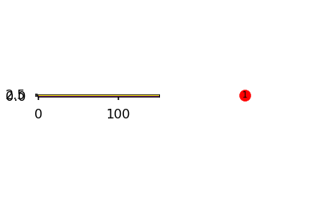

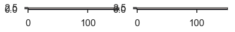

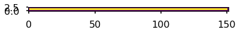

The same keyword and plot output is shown as described in the
`FilFinder2D
tutorial <http://fil-finder.readthedocs.io/en/latest/tutorial.html>`__.

The networkx graph can be accessed from ``fil.graph`` and can be
plotted:

.. code:: python

    fil.plot_graph()

Filaments with multiple branches have more interesting looking graphs.

The lengths and branch properties are now defined:

.. code:: python

    fil.length()

.. math::

    149 \; \mathrm{pix}

.. code:: python

    fil.branch_properties.keys()

.. parsed-literal::

    dict_keys(['length', 'intensity', 'number', 'pixels'])

The longest path skeleton is now defined as well. The skeleton array of
the longest path can be returned with:

.. code:: python

    plt.imshow(fil.skeleton(out_type='longpath', pad_size=10), origin='lower')

.. parsed-literal::

    <matplotlib.image.AxesImage at 0x7f157be82518>

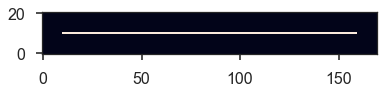

Orientation and Curvature
-------------------------

The RHT analysis on the longest path is run with:

.. code:: python

    fil.rht_analysis()
    print(fil.orientation, fil.curvature)

.. parsed-literal::

    1.5707963267948966 rad 0.26411662612097775 rad

The RHT distribution can be plotted with:

.. code:: python

    fil.plot_rht_distrib()

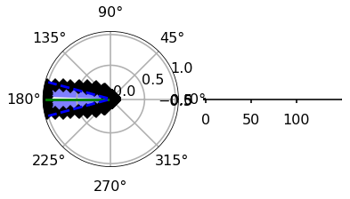

And the distribution can be accessed with
``Filament2D.orientation_hist``, which contains the bins and the
distribution values.

To run on individual branches, use:

.. code:: python

    fil.rht_branch_analysis()
    print(fil.orientation_branches, fil.curvature_branches)

.. parsed-literal::

    [1.57079633] rad [0.26411663] rad

The properties of branches can be returned with:

.. code:: python

    fil.branch_table()

.. raw:: html

    <i>Table length=1</i>
    <table id="table139730249548576" class="table-striped table-bordered table-condensed">
    <thead><tr><th>length</th><th>intensity</th></tr></thead>
    <thead><tr><th>pix</th><th></th></tr></thead>
    <thead><tr><th>float64</th><th>float64</th></tr></thead>
    <tr><td>149.0</td><td>1.0999999999999996</td></tr>
    </table>

And with the orientation and curvature branch information:

.. code:: python

    fil.branch_table(include_rht=True)

.. raw:: html

    <i>Table length=1</i>
    <table id="table139730199717760" class="table-striped table-bordered table-condensed">
    <thead><tr><th>length</th><th>intensity</th><th>orientation</th><th>curvature</th></tr></thead>
    <thead><tr><th>pix</th><th></th><th>rad</th><th>rad</th></tr></thead>
    <thead><tr><th>float64</th><th>float64</th><th>float64</th><th>float64</th></tr></thead>
    <tr><td>149.0</td><td>1.0999999999999996</td><td>1.5707963267948966</td><td>0.26411662612097775</td></tr>
    </table>

Radial Profiles and Widths
--------------------------

The radial profiles and width analysis is run with
``Filament2D.width_analysis``. Most of the inputs are the same as those
for ``FilFinder2D.find_widths``, with a few key differences:

-  The image must be given.
-  The total skeleton array must also be given, since each
   ``Filament2D`` is unaware of other filaments.
-  The beam width must be given for the FWHM to be deconvolved.

To reproduce the ``FilFinder2D`` analysis:

.. code:: python

    fil.width_analysis(filfind.image, all_skeleton_array=filfind.skeleton, beamwidth=filfind.beamwidth,
                       max_dist=0.3 * u.pc)

The radial profile is contained in ``fil.radprofile`` and can be plotted
with:

.. code:: python

    fil.plot_radial_profile(xunit=u.pc)

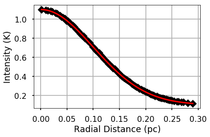

The parameters, uncertainty, model type, and check for fit quality are
contained in:

.. code:: python

    print(fil.radprof_parnames)
    print(fil.radprof_params)
    print(fil.radprof_errors)
    print(fil.radprof_type)
    print(fil.radprof_fit_fail_flag)

.. parsed-literal::

    ['amplitude_0', 'stddev_0', 'amplitude_1']
    [<Quantity 1.00078556>, <Quantity 9.99775856>, <Quantity 0.09998652>]
    [<Quantity 0.00189642>, <Quantity 0.0165278>, <Quantity 0.00059495>]
    gaussian_bkg
    False

The (possibly) deconvolved FWHM is:

.. code:: python

    fil.radprof_fwhm(u.pc)

.. parsed-literal::

    (<Quantity 0.23351 pc>, <Quantity 0.0003924 pc>)

The first element is the FWHM and the second is the error.

Note that the fit has correctly recovered the model parameters set at
the beginning.

An astropy table can be returned with the complete fit results:

.. code:: python

    fil.radprof_fit_table(unit=u.pc)

.. raw:: html

    <i>Table length=1</i>
    <table id="table139730248615360" class="table-striped table-bordered table-condensed">
    <thead><tr><th>amplitude_0</th><th>amplitude_0_err</th><th>stddev_0</th><th>stddev_0_err</th><th>amplitude_1</th><th>amplitude_1_err</th><th>fwhm</th><th>fwhm_err</th><th>fail_flag</th><th>model_type</th></tr></thead>
    <thead><tr><th></th><th></th><th></th><th></th><th></th><th></th><th>pc</th><th>pc</th><th></th><th></th></tr></thead>
    <thead><tr><th>float64</th><th>float64</th><th>float64</th><th>float64</th><th>float64</th><th>float64</th><th>float64</th><th>float64</th><th>bool</th><th>str12</th></tr></thead>
    <tr><td>1.0007855625803985</td><td>0.0018964160055463767</td><td>9.99775856017537</td><td>0.01652780418619165</td><td>0.09998652036316304</td><td>0.0005949451821499358</td><td>0.2335099973611502</td><td>0.00039239889215719536</td><td>False</td><td>gaussian_bkg</td></tr>
    </table>

And finally the fit model itself can be accessed with:

.. code:: python

    fil.radprof_model

.. parsed-literal::

    <CompoundModel3(amplitude_0=1.00078556, mean_0=0., stddev_0=9.99775856, amplitude_1=0.09998652)>

The radial profile can be returned as an astropy table with
``fil.radprof_table(xunit=u.pc)``.

Other Outputs
-------------

The total intensity of the filament within the FWHM is:

.. code:: python

    fil.total_intensity()

.. math::

    3497.8689 \; \mathrm{K}

And with the fitted background removed:

.. code:: python

    fil.total_intensity(bkg_subtract=True)

.. math::

    3112.3209 \; \mathrm{K}

The model image from the radial profile fit:

.. code:: python

    plt.imshow(fil.model_image(), origin='lower')
    plt.colorbar()

.. parsed-literal::

    <matplotlib.colorbar.Colorbar at 0x7f157bd1ad68>

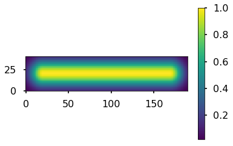

By default, the background level is subtraced. Without the subtraction:

.. code:: python

    plt.imshow(fil.model_image(bkg_subtract=False), origin='lower')
    plt.colorbar()

.. parsed-literal::

    <matplotlib.colorbar.Colorbar at 0x7f157b3434a8>

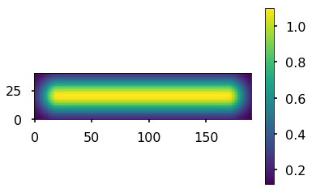

The median along the skeleton:

.. code:: python

    fil.median_brightness(filfind.image)

.. parsed-literal::

    1.1

This is consistent with the max of the model image:

.. code:: python

    filfind.image.max()

.. math::

    1.1 \; \mathrm{K}

The profile along the longest path skeleton:

.. code:: python

    plt.plot(fil.ridge_profile(filfind.image))

.. parsed-literal::

    [<matplotlib.lines.Line2D at 0x7f157bd30978>]

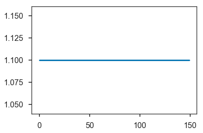

In this case, the ridge is constant in the model.

One feature that is not included in ``FilFinder2D`` is
``Filament2D.profile_analysis``, which creates a set of profiles
perpendicular to the longest path skeleton. This is useful for measuring
filament properties as a function of position, rather than creating a
single radial profile:

.. code:: python

    profs = fil.profile_analysis(filfind.image, xunit=u.pc, max_dist=30 * u.pix)
    for dist, prof in zip(profs[0], profs[1]):
        plt.plot(dist, prof)
    plt.ylabel("Amplitude")
    plt.xlabel("Distance from skeleton (pc)")

.. parsed-literal::

    Text(0.5,0,'Distance from skeleton (pc)')

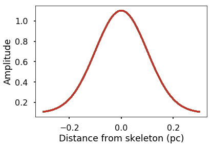

Plotted here are all of the radial profiles. For this model, however,
they are all the same. Fitting of the radial profiles is not included in
``Filament2D`` due to the complexity that some radial slices can show in
real filaments. See a dedicated package for this type of analysis, such
as `radfil <https://github.com/catherinezucker/radfil>`__.

Saving the Output
-----------------

A FITS file can be saved with a stamp of the image, skeleton, longest
path skeleton, and the filament model:

.. code:: python

    fil.save_fits("filament_stamp.fits", filfind.image)

Saving a ``Filament2D`` object
------------------------------

The object can be saved and loaded as a pickle file:

.. code:: python

    fil.to_pickle('filament.pkl')

.. code:: python

    loaded_fil = Filament2D.from_pickle('filament.pkl')
    loaded_fil.length()

.. math::

    149 \; \mathrm{pix}

