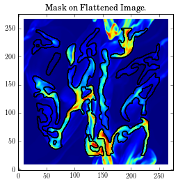
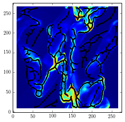
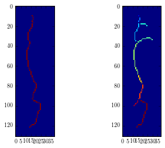
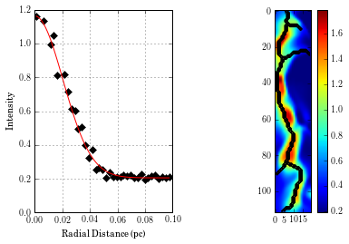

fil\_finder Tutorial
====================

**For brevity, only a few example output images are shown.
The entire set can be found in the Ipython notebook in the examples folder.**

Load in the algorithm and the usual suspects.

.. code:: python

    from astropy.io.fits import getdata
    from fil_finder import fil_finder_2D
    img, hdr = getdata("filaments_updatedhdr.fits", header=True)

Next we initialize the fil\_finder\_2D object.

The algorithm requires a few inputs to begin (other than the image and
header):
* ``beamwidth`` - in arcseconds (set to 15.1 arcsec, though this is a
  simulated image, a none zero value is needed as it sets the minimum size
  a filament can be).
* ``skel_thresh`` - minimum pixels a skeleton
  must contain to be considered (= 30 pixels)
* ``branch_thresh`` -
  minimum length for a branch. This sets one of the skeleton pruning
  criteria. If the intensity along it is significant to the filament, or
  if its deletion will change the graph connectivity, it will still be
  kept. (= 5 pixels)
* ``pad_size`` - number of pixels to pad around each
  filament. This ensures the adaptive thresholding can reach the edges of
  the image. Must be at least 1 pixel. (= 10 pixels, about the size of the
  patch used).
* ``distance`` - distance to the region in parsecs. This is
  used to set the size of the adaptive thresholding patch. The input is
  optional. If no distance is provided, results remain in pixel units (=
  260 pc, distance set for the simulation).
* ``glob_threshold`` - sets the
  percentile of data to ignore. This is intended to remove noisy regions
  of the data. (= 20%)
* ``flatten_thresh`` - sets the normalization to
  use in the arctan transform (flattens bright, compact regions). This
  parameter is generally set automatically, but we seem to get better
  results by setting it to the 95% percentile.

.. code:: python

    fils = fil_finder_2D(img, hdr, 15.1, 30, 5, 10, distance=260, glob_thresh=20, flatten_thresh=95)

The algorithm has several steps, which will be outlined below. Using the
run() function will perform all the steps in one with the algorithm
defaults.

Masking
-------
We begin by creating the mask of the image. All of the parameters are
set by default based on physical parameters. However this simulation
doesn't quite adhere to these and so the effect of manipulating these
parameters is shown in the next few steps.

.. code:: python

    fils.create_mask(verbose=True)

Here is the default mask. The algorithm has largely picked out the
filamentary structure, but there are two issues. First, the mask is not
able to go to the edges of the image, due to the padding with ``Nans``.
To fix this, we invoke the ``border_masking=False`` input.

.. code:: python

    # Reset the mask
    fils.mask = None
    fils.create_mask(verbose=True, border_masking=False)

.. image:: images/fil_finder_11_0.png

This is better, but some variations within the regions are being
combined together. To try to pick up on the smaller scale variations, we
can try using a smaller patch-size for the adaptive thresholding.
Typically, we attain a good mask using a patch size of

.. math:: 0.2 \textrm{pc}/ \textrm{pixel size}.

This works well for observational data, but the filaments in this small
simulation aren't quite the same. So let us try half of the normal patch
size,

.. code:: python

    fils.mask = None
    fils.create_mask(verbose=True, border_masking=False, adapt_thresh=13.)

.. image:: images/fil_finder_13_0.png

This hasn't made a large difference. In general if the patch size is a
reasonable size based on physical information, the mask obtained will be
largely the same.

There are a couple of other parameters based off of physical priors. One
of these is a smoothing filter, which is generally set to be
:math:`~0.05` pc, so as to smooth the small scale variations leading to
more continuous regions. Let's try half of this size as we did before.
This corresponds to about 3 pixels.

.. code:: python

    fils.mask = None
    fils.create_mask(verbose=True, border_masking=False, adapt_thresh=13., smooth_size=3.0)

.. image:: images/fil_finder_15_0.png

Again, this has not made a large difference which ensures that the
smoothing is only acting on scales smaller than we care about here.

The next parameter to try is to disable the regridding function. The
algorithm has functionality to double the image size for the purposes of
adaptive thresholding. When a small patch size is used for the
thresholding, regions become too skinny and often fragment into small
pieces. To deal with this pixelization issue, we perform the
thresholding on the super-sampled image. This negates the patch size
issue, and we obtain a better mask after regridding to the original
size.

.. code:: python

    fils.mask = None
    fils.create_mask(verbose=True, border_masking=False, adapt_thresh=13., smooth_size=3.0, regrid=False, zero_border=True, size_thresh=300.)

.. image:: images/fil_finder_17_0.png

That's better! Not only are the small scale features better
characterized, but some additional faint regions have also been picked
up.

Regridding is useful only when the regions are becoming fragmented.
As a default, it is enabled when the patch size is less than 40 pixels.
This value is based on many trials with observational data.

Note that pre-made masks can also be supplied to the algorithm during
initialization without completing this step. As a default, if a mask has
been attached to the object it will assume that that mask has been
prescribed and will skip the mask making process.

Skeletons
---------

The next step in the algorithm is to use a Medial Axis Transform to
return the skeletons of the regions. These skeletons are the actual
objects used to derive the filament properties. We make the assumption
that the skeletons run along the ridge of the filament so that they can
be defined as the centers.

.. code:: python

    fils.medskel(verbose=True)

Pruning and Lengths
-------------------

Now begins the analysis of the filaments! This begins with finding the
length. The skeletons are also pruned during this process to remove
short branches which aren't essential. This is preferable over
traditional pruning methods which shorten the entire skeleton.

A whole ton of information is printed out when verbose mode is enabled.
* The first set show the skeletons segmented into their branches (and
  intersections have beem removed). Their connectivity graphs are also
  shown. Their placement is unfortunately only useful for small
  structures.
* Next, the longest paths through the skeleton are shown.
  This is determined by the length of the branch and the median brightness
  along it relative to the rest of the structure. These lengths are
  classified as the main length of the filament.
* The final set shows
  the final, pruned skeletons which are recombined into the skeleton image
  to be used for the rest of the analysis.

.. code:: python

    fils.analyze_skeletons(verbose=True)

.. image:: images/fil_finder_22_13.png

.. image:: images/fil_finder_22_82.png

Let's plot the final skeletons before moving on:

.. code:: python

    p.imshow(fils.flat_img, interpolation=None, origin='lower')
    p.contour(fils.skeleton, colors='k')

.. image:: images/fil_finder_24_1.png

The original skeletons didn't contain too many spurious features, so
there is relatively little change.

Curvature and Direction
-----------------------

Following this step, we use a version of the `Rolling Hough
Transform <http://adsabs.harvard.edu/abs/2014ApJ...789...82C>`__ to find
the orientation of the filaments (median of transform) and their
curvature (IQR of transform).

The polar plots shown plot :math:`2\theta`. The transform itself is
limited to :math:`(-\pi/2, \pi/2)`. The first plot shows the transform
distribution for that filament. Beside it is the CDF of that
distribution. By default, the transform is applied on the longest path
of the skeleton. It can also be applied on a per-branch basis. This
destroys information of the filaments relative to each other, but gives
a better estimate for the image as a whole.

.. code:: python

    fils.exec_rht(verbose=True)

.. image:: images/fil_finder_26_13.png

Widths
------

One of the final steps is to find the widths of the filaments.
``fil_finder`` supports three different models to fit to the radial
profiles. By default, a Gaussian with a background and mean zero is
used. Using the ``fit_model`` parameter, a Lorentzian model or radial
cylindrical model can also be specified (imported from
``fil_finder.widths``). With observational data, we found that many
profiles are not well fit by these idealized cases. A non-parametric method
has developed for these cases. It simply estimates the peak
and background levels and esimates the width by interpolating between them. This
is enabled, by default, using ``try_nonparam``. If a fit returns a lousy
:math:`\chi^2` value, we attempt to use this method.

Fits are rejected based on a set of criteria:
* Background is above the peak
* Errors are larger than the respective parameters
* The width is too small to be deconvolved from the beamwidth
* The width is not appreciably smaller than the length
* The non-parametric method cannot find a reasonable estimate

**Note:** Each profile is plotted before invoking the rejection criteria.
This is why some of the plots created will look suspect. Also, the
fitted lines are based on the model given (gaussian for this case) and
since the non-parameteric method is not quite this profile, the fits will
appear to be overestimated.

.. code:: python

    fils.find_widths(verbose=True)

.. parsed-literal::

    # Order: [Amplitude, Half-width, Background, Deconvolved FWHM]
    Fit Parameters: [ 0.19037385  0.09057394  0.02852461  0.20715061]
    Fit Errors: [ 0.04603811  0.09476529  0.07063716  0.0828698 ]
    Fit Type: nonparam

Further Methods and Properties
------------------------------

While the above represent the major filamentary properties, some others
can also be computed.

As part of the width finding function, the sum of the intensity within
the filament's width is found. It requires information from the radial
profiles, which are not returned, and is therefore lopped into that
process. They can be accessed by ``fils.total_intensity``.

The median intensity of each filament can also be found using the
function ``fils.compute_filament_brightness``. This estimate is along
the ridge of the filament, unlike ``fils.total_intensity`` which is
within the fitted width.

Finally, we can model the filamentary network found in the image using
``fils.filament_model``. Using the fitted profile information, filaments
whose fits did not fail can be estimated. For this image, the model is
shown below.

.. code:: python

    p.imshow(fils.filament_model(), interpolation=None, origin='lower')

.. image:: images/fil_finder_30_1.png

Though not a perfect representation, it gives an esimate of the network
and the relation of the intensity in the network versus the entire
image. This fraction is computed by the function
``fils.find_covering_fraction``:

.. code:: python

    fils.find_covering_fraction()
    print fils.covering_fraction  # 0.593953590473

Approximately 60% of the total intensity in the image is coming from the
filamentary network. This seems reasonable, as the algorithm inherently
ignores compact features, whose intensities generally greatly exceed
that of the filaments.

Saving Outputs
--------------

Saving of outputs created by the algorithm are split into 2 functions.

Numerical data is dealt with using ``fils.save_table``. This combines
the results derived for each of the portions into a final table. We use
the `astropy.table <http://astropy.readthedocs.org/en/latest/table/>`__
package to save the results. Currently, the type of output is specified
through ``table_type`` and accepts 'csv', 'fits', and 'latex' as valid
output types. If the output is saved as a fits file, branch information
is not saved as BIN tables do not accept lists as an entry. The data
table created can be accessed after through ``fils.dataframe``, which is
accepted by the ``Analysis`` object.

Image products are saved using ``fils.save_fits``. By default, the mask,
skeleton, and model images are all saved. Saving of the model can be
disabled through ``model_save=False``. The output skeleton FITS file has
one extension of the final, cleaned skeletons, and a second containing
only the longest path skeletons. Optionally, stamp images of each
individual filament can be created using the `stamps` argument.
These contain a portion of the
image, the final skeleton, and the longest path in the outputted FITS
file. The files are automatically saved in a 'stamps\_(save\_name)'
folder.

