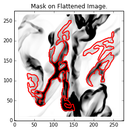
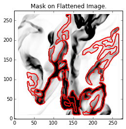
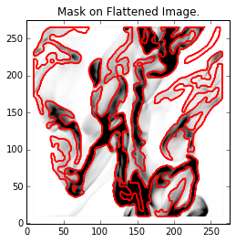
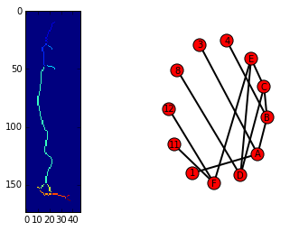
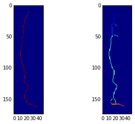
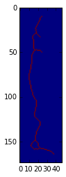
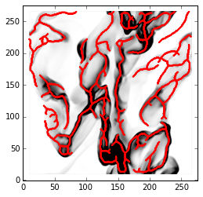
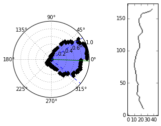
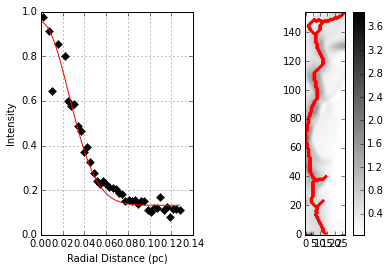
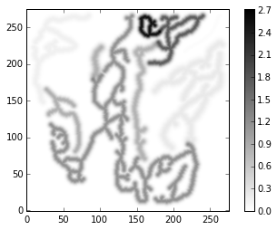

FilFinder Tutorial
==================

The main FilFinder algorithm is implemented in the ``fil_finder_2D``
class. This tutorial goes through the steps to run the entire algorithm.

**NOTE: The example image is simulated data and has a continuous
boundary. FilFinder can not yet deal with this case and so the results
shown below do not include joining what should be continuous regions.**

Load in the algorithm and along with astropy to read in the FITS file.

.. code:: python

    from astropy.io import fits
    from astropy import units as u
    from fil_finder import fil_finder_2D
    import matplotlib.pylab as pylab
    pylab.rcParams['figure.figsize'] = (20.0, 16.0)
    import matplotlib.pyplot as p
    %matplotlib inline

FilFinder accepts two forms of the input data:

1. A numpy array and the header.

.. code:: python

    img, hdr = fits.getdata("filaments_updatedhdr.fits", header=True)
2. Or the HDU

.. code:: python

    fits_hdu = fits.open("filaments_updatedhdr.fits")[0]

When provided with the FITS HDU, the attached header is used. The algorithm requires only the image, however all results will be returned in pixel units without also giving the FITS header and the distance.

The FWHM beamwidth is provided throught the `beamwidth` keyword. This can be passed any angular units available in the `astropy.units` package. **If no units are given, pixel units are assumed.**.

The distance is specified with the ``distance`` keyword. As for the `beamwidth`, a distance unit can be provided. **If no unit is given, parsecs are assumed.** Many
of the default settings for parameters are dependent on physical
scaling; **if no distance is provided, all parameters that have defaults
must be specified**. Errors are raised which indicate which parameters need to be set.

While the algorithm has multiple parameters, these are automatically set
to default values which we found work well with the 250 & 350 micron
Herschel maps. Some adjustments may be needed when working with data
from other sources. A full explanation can be found in `the
docs <http://fil-finder.readthedocs.org/en/latest/fil_finder_2d.html>`__
and a shortened version of some of the parameters is given here:

* ``skel_thresh`` - a threshold (given in pixel units) for the minimum
  pixels a skeleton must contain to be considered (default 0.3 pc)
* ``branch_thresh`` - the minimum length (in pixels) that a branch should
  have (default 3 :math:`\times` FWHM beamwidth). This sets one of the
  skeleton pruning criteria. If the intensity along it is significant to
  the filament, or if its deletion will change the graph connectivity, it
  will still be kept.
* ``size_thresh`` - the minimum pixel area a region
  in the mask should have to be considered a real feature (default
  :math:`5\pi (0.1\mathrm{pc})^2)`. Previous usage of the algorithm has
  shown the real features tend to be a part of a network and will have
  large areas that deviate greatly from the elliptical areas. **This
  parameter likely needs to be altered from the default!**
* ``pad_size`` - number of pixels to pad around each filament (default 10 pixels). This
  serves 2 purposes: to provide padding along the edges of the image while
  performing adaptive thresholding and to increase the maximum extent of
  the radial profiles for each of the filaments. If the size of the
  adaptive thresholding patch is large, this may need to be increased.
* ``flatten_thresh`` - the flattening threshold that sets the
  normalization to use in the arctan transform (flattens bright, compact
  regions). When specified, it corresponds to the percentile of the
  intensity distribution (0-100). This parameter is set automatically by
  fitting a log-normal distribution to the intensities in the images and
  setting the threshold to :math:`\mu + 2\sigma`. The simulated image
  presented here doesn't follow a log-normal very well and we seem to get
  better results by setting it to the 95% percentile.
* ``glob_thresh`` - a global threshold that sets the percentile of data to ignore. This is
  intended to remove noisy regions of the data. If no value is given, the
  algorithm does not apply any global thresholding and used the entire
  image. For this tutorial, the 20% percentile is used as the cutoff.

.. code:: python

    fils = fil_finder_2D(img, header=hdr, beamwidth=10.0*u.arcsec,
                         distance=260*u.pc, glob_thresh=20, flatten_thresh=95)

Or by giving an HDU,

.. code:: python

    fils = fil_finder_2D(fits_hdu, beamwidth=10.0*u.arcsec,
                         distance=260*u.pc, glob_thresh=20, flatten_thresh=95)

The algorithm has several steps, which will be outlined below. Using the
``run`` function will perform all the steps in one with the algorithm
defaults. For greater control of each step, each step can be run, which
is shown in this tutorial.

Masking
-------

We begin by creating the mask of the image. All of the parameters are
set by default based on physical parameters. However this simulation
doesn't quite adhere to these and so the effect of manipulating these
parameters is shown in the next few steps.

**NOTE:** A pre-made mask can be specified if you already have computed
one, or have one from another source. Specify the mask using the
``mask`` keyword while creating the ``fil_finder_2D`` object (as shown
above). Then enable its use by specifying ``use_existing_mask=True`` in
the line below.

.. code:: python

    fils.create_mask(verbose=True)

Here is the default mask. The algorithm has picked out some of the
filamentary structure, but there most of the structure is ignored. The
mask is not able to go to the edges of the image, due to the padding
with ``NaNs``. To fix this, we invoke the ``border_masking=False``
input. For observational data, the edges are often dominated by noisy
artifacts, but in this simulated image, there is usable data right to
the edges.

.. code:: python

    fils.create_mask(verbose=True, border_masking=False, use_existing_mask=False)

This is an improvement, but a lot of the structures remain ignored. As
stated above, the default value for ``size_thresh`` may need to be
altered, and it certainly does for this image. After trying a few
values, an area of 430 pixels seems to work very well.

.. code:: python

    fils.create_mask(verbose=True, border_masking=False, size_thresh=430, use_existing_mask=False)

That's better! Not only are the small scale features better
characterized, but some additional faint regions have also been picked
up.

With well-defined regions, the skeletons can now be found using a Medial
Axis Transform.

Skeletons
---------

The next step in the algorithm is to use a Medial Axis Transform to
return the skeletons of the regions. These skeletons are the actual
objects used to derive the filament properties. We make the assumption
that the skeletons run along the ridge of the filament so that they can
be defined as the centers.

.. code:: python

    fils.medskel(verbose=True)

Pruning and Lengths
-------------------

Now begins the analysis of the filaments! This begins with finding the
length. The skeletons are also pruned during this process to remove
short branches which aren't essential. This is preferable over
traditional pruning methods which shorten the entire skeleton.

A whole ton of information is printed out when verbose mode is enabled.

* The first set show the skeletons segmented into their branches (and
  intersections have beem removed). Their connectivity graphs are also
  shown. Their placement is unfortunately only useful for small
  structures.
* Next, the longest paths through the skeleton are shown.
  This is determined by the length of the branch and the median brightness
  along it relative to the rest of the structure. These lengths are
  classified as the main length of the filament.
* The final set shows the final, pruned skeletons which are recombined into the skeleton image
  to be used for the rest of the analysis.

The parameter ``skel_thresh`` sets the minimum pixels a skeleton must
contain (roughly the minimum length). By default, this is set in pixel
units to correspond to 0.3 pc (giving an aspect ratio of 3 for the
average filament). This cuts off a small, real feature in the simulated
image, so it has been lowered to 20 pixels (~0.15 pc). Multiple other
parameters may be set for this stage; see the documentation for a full
explanation of each.

.. code:: python

    fils.analyze_skeletons(verbose=True, skel_thresh=20.0)

.. parsed-literal::

    Filament: 2 / 9

Let's plot the final skeletons before moving on:

.. code:: python

    import numpy as np
    vmin = np.percentile(fils.flat_img[np.isfinite(fils.flat_img)], 20)
    vmax = np.percentile(fils.flat_img[np.isfinite(fils.flat_img)], 90)
    p.imshow(fils.flat_img, interpolation=None, origin="lower",
             cmap='binary', vmin=vmin, vmax=vmax)
    p.contour(fils.skeleton, colors='r')

The original skeletons didn't contain too many spurious features, so
there is relatively little change.

Curvature and Direction
-----------------------

Following this step, we use a version of the `Rolling Hough Transform
(RHT) <http://adsabs.harvard.edu/abs/2014ApJ...789...82C>`__ to find the
orientation of the filaments (circular mean of transform) and their curvature
(IQR of transform).

The polar plots shown plot :math:`2\theta`. The transform itself is
limited to :math:`(-\pi/2, \pi/2)` since the direction is ambiguous. :math:`\theta=0` is defined along the positive y axis. The first plot shows the transform distribution for that filament. Beside it is the CDF of that distribution.

By default, the transform is applied on the longest path of the
skeleton. It can also be applied on a per-branch basis by enabling the
``branches=True`` when running ``exec_rht``. This destroys information
of the filaments relative to each other, but gives a better estimate for
the image as a whole.

.. code:: python

    fils.exec_rht(verbose=True)

Widths
------

One of the final steps is to find the widths of the filaments. This is
accomplished by building a radial profile along the filament, defining
the skeleton as the middle. Pixels are binned based on their minimum
distance from the nearest skeleton pixel. Pixels can only belong to one
skeleton, the skeleton to which it is closest.

``fil_finder`` supports three different models to fit to the radial
profiles. By default, a Gaussian with a constant background is used.
Using the ``fit_model`` parameter, a Lorentzian model or radial
cylindrical model can also be specified (imported from
``fil_finder.widths``). **The Gaussian model is the most tested and is
recommended for most uses**.

With some images, a small number of profiles were not well fit by these
idealized cases. For these, there is a non-parameteric method that
simply estimates a peak and background and interpolates between them to
estimate the width. This is enabled, by default, using the
``try_nonparam`` keyword in ``find_widths``. If a fit returns a bad fit
(based on it reduced :math:`\chi^2` value), the non-parameteric method
is attempted. Most of the cases where the non-parametric method is used
correspond to regions that have many neighbouring filaments and the
number of pixels belonging to a single filament decreases greatly.

Fits are rejected based on a set of criteria:

* Background is above the peak
* Errors are larger than the respective parameters
* The width is too small to be deconvolved from the beamwidth
* The width is not appreciably smaller than the length
* The non-parametric method cannot find a reasonable estimate

*Note:* Each profile is plotted before invoking the rejection criteria.
This is why some of the plots below may look suspect. The fitted lines
are based on the model given (gaussian for this case) and since the
non-parameteric method is not quite this profile, those fits will appear
to be overestimated.

**The order of the parameter values shown is: Amplitude, Width,
Background, FWHM.**

.. code:: python

    fils.find_widths(verbose=True)

.. parsed-literal::

    1 in 9
    Fit Parameters: [ 0.95279165  0.02563813  0.1323161   0.06013541]
    Fit Errors: [ 0.01423218  0.00146024  0.01652742  0.00343860]
    Fit Type: gaussian

All of the fits in this image correspond well to a Gaussian profile.
Note the large range of peak amplitudes in the fits; #8 peaks near 3 K,
while #7 peaks much lower at 0.060 K.

Further Methods and Properties
------------------------------

While the above represent the major filamentary properties, some others
can also be computed.

As part of the width finding function, the sum of the intensity within
the filament's width is found. It requires information from the radial
profiles, which are not returned, and is therefore lopped into that
process. They can be accessed by ``fils.total_intensity``.

The median intensity of each filament can also be found using the
function ``fils.compute_filament_brightness``. This estimate is along
the ridge of the filament, unlike ``fils.total_intensity`` which is
within the fitted width.

Finally, we can model the filamentary network found in the image using
``fils.filament_model``. Using the fitted profile information, filaments
whose fits did not fail can be estimated. For this image, the model is
shown below.

.. code:: python

    p.imshow(fils.filament_model(), interpolation=None, origin='lower', cmap='binary')
    p.colorbar()

Though not a perfect representation, it gives an estimate of the network
and the relation of the intensity in the network versus the entire
image. This fraction is computed by the function
``fils.find_covering_fraction``:

.. code:: python

    fils.find_covering_fraction()
    print fils.covering_fraction

.. parsed-literal::

    0.622995650734

Approximately 60% of the total intensity in the image is coming from the
filamentary network. This seems reasonable, as the algorithm inherently
ignores compact features, whose intensities generally greatly exceed
that of the filaments.

Saving Outputs
--------------

When ``verbose=True``, is enabled, the algorithm will interactively display
plots at points during the algorithm. If there are hundreds of individual
filaments found, this quickly becomes unfeasible. In this case, ``verbose``
can be disabled and those plots can be saved in "png" form by enabling
``save_png``. This is an accepted keyword for all functions that also
accept ``verbose``.

Saving of the mask, skeletons, and catalog created by the algorithm are
split into 2 functions.

Numerical data is dealt with using ``fils.save_table``. This combines
the results derived for each of the portions into a final table. We use
the `astropy.table <http://astropy.readthedocs.org/en/latest/table/>`__
package to save the results. Currently, the type of output is specified
through ``table_type`` and accepts 'csv', 'fits', 'hdf5', and 'latex' as valid
output types. If the output is saved as a fits file, branch information
is not saved as BIN tables do not accept lists as an entry. The data
table created can be accessed after through ``fils.dataframe``, which is
accepted by the ``Analysis`` object.

Image products are saved using ``fils.save_fits``. By default, the mask,
skeleton, and model images are all saved. Saving of the model can be
disabled through ``model_save=False``. The output skeleton FITS file has
one extension of the final, cleaned skeletons, and a second containing
only the longest path skeletons. Optionally, stamp images of each
individual filament can be created. These contain a portion of the
image, the final skeleton, and the longest path in the outputted FITS
file. The files are automatically saved in a 'stamps\_(save\_name)'
folder.
