FilFinder Tutorial
==================

This tutorial demonstrates the FilFinder algorithm on a simulated data
set. The updated algorithm from ``FilFinder2D`` is used here, which is
valid for versions >1.5. This tutorial was tested with python 3.6.

The example data is included in the github repository
`here <https://github.com/e-koch/FilFinder/blob/master/examples/filaments_updatedhdr.fits>`__.

.. code:: python

    %matplotlib inline
    import matplotlib.pyplot as plt
    import astropy.units as u

    # Optional settings for the plots. Comment out if needed.
    import seaborn as sb
    sb.set_context('poster')

    import matplotlib as mpl
    mpl.rcParams['figure.figsize'] = (12., 9.6)

Input Data
----------

There are two caveats to the input data:

1) All angular and physical conversions assume that pixels in the image
   can be treated as squares. ``FilFinder2D`` is not aware of any axis
   misalignments! If you're data does not have aligned celestial axes,
   we recommend reprojecting the data onto a square grid.

2) The beam size is characterized by the major axis, assuming a 2D
   Gaussian beam shape. If the beam size of your data is highly
   elliptical, it is recommended to convolve the data to a circular
   beam.

``FilFinder2D`` accepts several input types, including a FITS HDU and
numpy arrays.

.. code:: python

    from fil_finder import FilFinder2D
    from astropy.io import fits

    hdu = fits.open("../examples/filaments_updatedhdr.fits")[0]

    fil = FilFinder2D(hdu)

.. code:: python

    # HDU data as an array
    arr = hdu.data
    hdr = hdu.header

    fil = FilFinder2D(arr)

.. parsed-literal::

    /home/eric/Dropbox/code_development/filaments/build/lib.linux-x86_64-3.6/fil_finder/filfinder2D.py:138: UserWarning: No beam width given. Using 0 pixels.
      warnings.warn("No beam width given. Using 0 pixels.")

In this case, no WCS information is given and all results will be
returned in pixel units. Angular units can be returned when the header
is specified:

.. code:: python

    fil = FilFinder2D(arr, header=hdr)

If `spectral-cube <https://spectral-cube.readthedocs.io/en/latest/>`__
is installed, the ``Projection`` or ``Slice`` classes can also be passed
to ``FilFinder2D``:

.. code:: python

    from spectral_cube import Projection

    proj = Projection.from_hdu(hdu)

    fil = FilFinder2D(proj)

.. parsed-literal::

    WARNING: A 'NAXIS1' keyword already exists in this header.  Inserting duplicate keyword. [astropy.io.fits.header]

Other Inputs to ``FilFinder2D``:
--------------------------------

Note that numerical inputs must be given as ``~astropy.units.Quantity``
object with the appropriate unit.

**Distance** -- To facilitate conversions to physical units, a distance
can be given to ``FilFinder2D``:

.. code:: python

    fil = FilFinder2D(hdu, distance=250 * u.pc)

**Angular Scale** -- If no header information is given, the
pixel-to-angular conversion can be given:

.. code:: python

    fil = FilFinder2D(arr, ang_scale=0.1 * u.deg)

.. parsed-literal::

    /home/eric/Dropbox/code_development/filaments/build/lib.linux-x86_64-3.6/fil_finder/base_conversions.py:55: UserWarning: Cannot find 'BMAJ' in the header. Try installing the `radio_beam` package for loading header information.
      warn("Cannot find 'BMAJ' in the header. Try installing"
    /home/eric/Dropbox/code_development/filaments/build/lib.linux-x86_64-3.6/fil_finder/base_conversions.py:63: UserWarning: Cannot find 'BMIN' in the header. Assuming circular beam.
      warn("Cannot find 'BMIN' in the header. Assuming circular beam.")
    /home/eric/Dropbox/code_development/filaments/build/lib.linux-x86_64-3.6/fil_finder/base_conversions.py:69: UserWarning: Cannot find 'BPA' in the header. Assuming PA of 0.
      warn("Cannot find 'BPA' in the header. Assuming PA of 0.")
    /home/eric/Dropbox/code_development/filaments/build/lib.linux-x86_64-3.6/fil_finder/filfinder2D.py:138: UserWarning: No beam width given. Using 0 pixels.
      warnings.warn("No beam width given. Using 0 pixels.")

**Beamwidth** -- If the major axis of the beam is contained in the
header, it will be automatically read in. If that information is not in
the header, the beam size can be passed separately:

.. code:: python

    fil = FilFinder2D(hdu, beamwidth=10 * u.arcsec)

**Custom Filament Masks** -- If you have a pre-computed filament mask,
the mask array can be passed:

.. code:: python

    # Example custom mask
    mask = hdu.data > 1.

    fil = FilFinder2D(hdu, mask=mask)

The custom mask must have the same shape as the inputed image.

**Save Name** -- A prefix for saved plots and table can be given:

.. code:: python

    fil = FilFinder2D(hdu, save_name="FilFinder_Output")

For the purposes of this tutorial, we will assume that the data has WCS
information and a well-defined distance:

.. code:: python

    fil = FilFinder2D(hdu, distance=260 * u.pc)

The beamwidth is :math:`24''` and is defined in the header.

Image Preprocessing
-------------------

Prior to creating the mask, it can be helpful to first *flatten* the
image of bright compact sources. ``FilFinder2D`` uses an arctan
transform, where the data are first normalized by some percentile value
of the data:

.. code:: python

    fil.preprocess_image(flatten_percent=95)

.. code:: python

    plt.subplot(121)
    plt.imshow(fil.image.value, origin='lower')
    plt.title("Image")
    plt.subplot(122)
    plt.imshow(fil.flat_img.value, origin='lower')
    plt.title("Flattened Image")
    plt.tight_layout()

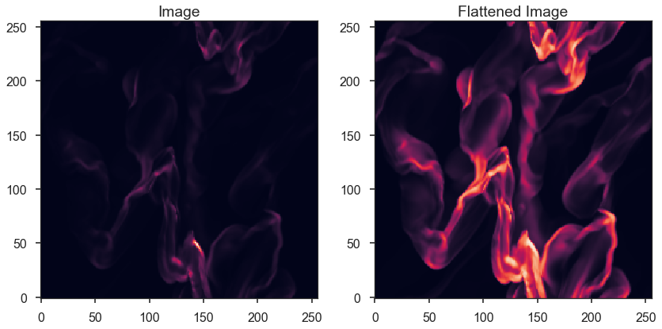

If a percentile is not given, ``FilFinder2D.preprocess_image`` will try
to fit a log-normal distribution to the data and will set the threshold
at :math:`\mu + 2 \sigma`. **There are no checks for the quality of the
fit. Use only if you are confident that the brightness distribution is
close to a log-normal.**

If you wish to run the masking procedure without flattening the image,
use the command:

.. code:: python

    fil.preprocess_image(skip_flatten=True)

The original image will be set as ``fil.flat_img`` and used in the
masking step.

For this example, we will use the prior flattened image.

.. code:: python

    fil.preprocess_image(flatten_percent=95)

Masking
-------

Creating the filament mask is a complex process performed by
``FilFinder2D.create_mask``. There are several parameters that set the
masking behaviour.

If a FITS header and distance were provided at the beginning,
``FilFinder2D`` will use default guesses based on typical filament sizes
from Herschel studies of the Gould Belt clouds (e.g., `Koch & Rosolowsky
2015 <https://ui.adsabs.harvard.edu/#abs/2015MNRAS.452.3435K/abstract>`__).
These choices will not be the optimal settings in general, and we
recommend trying different different parameter setting before using the
resulting mask for the analysis.

If a distance was not provided, these parameters must be set.
``FilFinder2D`` will raise errors until the required parameters are
given.

This simulated data set is an example where the default ``FilFinder2D``
settings do not provide an ideal filament mask:

.. code:: python

    fil.create_mask(verbose=True)

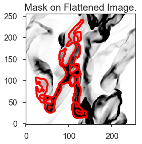

Most of the filamentary structure has been ignored by the mask. There
are several parameters that can be set to improve the mask:

-  ``glob_thresh`` -- Set a minimum intensity for a pixel to be included
   in the mask. This is useful for removing noisy regions in the data
   from the mask. Must have the same units as ``fil.image``.
-  ``adapt_thresh`` -- The width of the element used for the adaptive
   thresholding mask. This is primarily the step that picks out the
   filamentary structure. The element size should be similar to the
   width of the expected filamentary structure. The default here, when
   distance is provided, is 0.1 pc.
-  ``smooth_size`` -- It is often helpful to smooth the data before
   calculating the mask. By smoothing in small scales, small noise
   variations are removed resulting in a simpler skeleton structure. The
   default is set to 0.05 pc.
-  ``size_thresh`` -- The minimum number of pixels a region of the mask
   must have to be considered real. The default is set by assuming a
   minimum filament size to be an ellipse with a 0.1 pc width and length
   of 0.5 pc. *Most data sets will require this parameter to be manually
   set,* as is used below.
-  ``regrid`` -- If the pixel width of ``adapt_thresh`` is less than 40
   pixels, the resulting mask may be fragmented due to pixelization. To
   increase the size of ``adapt_thresh``, ``regrid`` interpolates the
   data onto a larger grid, calculates the mask on the larger grid, then
   interpolates the mask at the original image size.
-  ``border_masking`` -- Observational maps may not fill the entire
   image, and the edges of the mapped regions tend to be noisier.
   ``border_masking`` finds regions of ``NaNs`` along the edge of the
   map and tries to remove noisy regions near the edges. Its behaviour
   can be controlled using ``border_kwargs``, where the size of a NaN
   region (``size``), size of the filter used to define noisy edges
   (``filt_width``), and the number of times to apply that filter
   (``eros_iter``) can be controlled.
-  ``fill_hole_size`` -- If there are holes within a skeleton,
   ``fill_hole_size`` can be used to fill in holes smaller than the
   given size.
-  ``use_existing_mask`` -- If you gave a user-defined mask when calling
   ``FilFinder2D``, enable this parameter to skip making a new mask.

Varying a few of these parameters will produce a much improved mask.
First, since the data go right to the edges of the image, we can disable
``border_masking``:

.. code:: python

    fil.create_mask(verbose=True, border_masking=False)

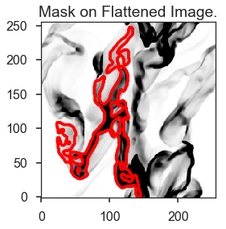

The mask now extends right to the edge of the data. However, only one
structure was retained. This occurs because ``size_thresh`` is too
large. We can manually set the value in pixel units. The size must have
units of area:

.. code:: python

    fil.create_mask(verbose=True, border_masking=False, size_thresh=400 * u.pix**2)

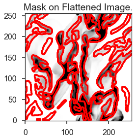

Much better! Most of the filamentary structure is now being included in
the mask.

This simulated image does not have noise added in, however, most data
sets will. The cell below demonstrates how to set ``glob_thresh`` to
avoid noisy regions:

.. code:: python

    # Define the noise value. As a demonstration, say values below the 20th percentile here are dominated by noise
    noise_level = np.percentile(fil.image, 20)
    noise_level

    plt.imshow(fil.image.value > noise_level, origin='lower')

.. parsed-literal::

    <matplotlib.image.AxesImage at 0x7f5472ec9da0>

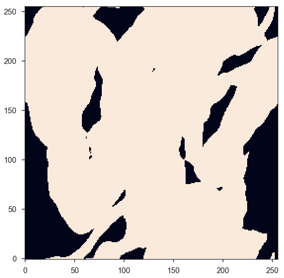

The dark regions will be excluded from the final mask. The filament mask
with the threshold is then:

.. code:: python

    fil.create_mask(verbose=True, border_masking=False, size_thresh=400 * u.pix**2, glob_thresh=0.0267)

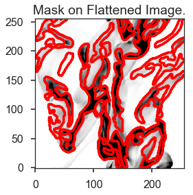

A few small region have been removed compared to the previous mask, but
the structure is largely unchanged in this case.

This is a usable mask for the filament analysis. The effects of altering
the other parameters are shown in `Koch & Rosolowsky
2015 <https://ui.adsabs.harvard.edu/#abs/2015MNRAS.452.3435K/abstract>`__.

Try varying each parameter to assess its affect on your data.

If you gave a user-defined mask at the beginning, run:

.. code:: python

    fil.create_mask(use_existing_mask=True)

.. parsed-literal::

    /home/eric/Dropbox/code_development/filaments/build/lib.linux-x86_64-3.6/fil_finder/filfinder2D.py:288: UserWarning: Using inputted mask. Skipping creation of anew mask.
      warnings.warn("Using inputted mask. Skipping creation of a"

Skeletonization
---------------

The next step is to reduce the mask into single-pixel-width skeleton
objects. These skeletons will define the location of a filament and its
path.

In ``FilFinder2D``, the `medial
axis <http://scikit-image.org/docs/0.10.x/auto_examples/plot_medial_transform.html>`__
is defined to be the skeleton:

.. code:: python

    fil.medskel(verbose=True)

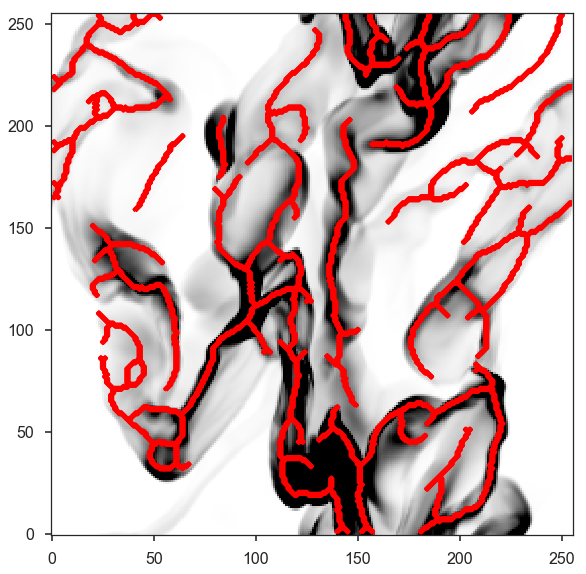

Skeletons: Pruning & Length
---------------------------

We are now prepared to analyze the filaments. The first analysis step
includes two parts: pruning the skeleton structures and finding the
filament lengths. The first part removes small/unimportant spurs on the
skeletons. To ensure important portions of the skeleton are retained,
however, both parts are performed together.

Each skeleton is converted into a graph object using the
`networkx <https://networkx.github.io/>`__ package. We use the graph to
find the longest path through the skeleton, which is used to define the
structure's length. All branches in the skeleton away from this longest
path are eligible to be pruned off.

This process is handled by the ``FilFinder2D.analyze_skeletons``
function. When using ``verbose=True``, a ton of plots will get returned.
To save you some scrolling, the verbose mode is highlighted for just one
filament below.

With just the default settings:

.. code:: python

    fil.analyze_skeletons()

    plt.imshow(fil.skeleton, origin='lower')

.. parsed-literal::

    <matplotlib.image.AxesImage at 0x7f5472dfa2b0>

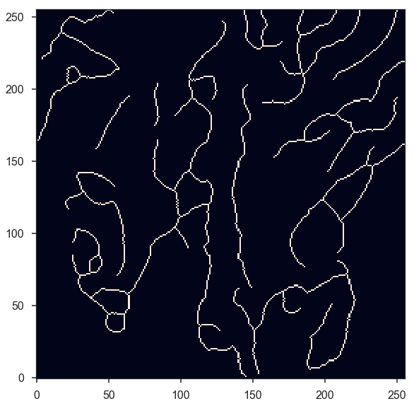

The skeletons are largely the same, with only short branches removed.

The default settings use minimum skeleton and branch lengths based off
of the beam size. To be kept, a branch must be at least three times the
length of the beam and a skeleton must have a length of 5 times the
beam. Practically, this will only remove very small features.

These parameters, and ones related to the pruning, can be manually set:

-  ``prune_criteria`` -- The criteria for removing a branch can be
   altered. The default ('all') uses a mix of the average intensity
   along the branch and its length. The length alone can be used for
   pruning with ``prune_criteria='length'``. All branches below this
   length will be removed. Finally, only the intensity can be used for
   pruning (``prune_criteria='intensity'``). A branch is kept in this
   case by comparing the average intensity along the branch to the
   average over the whole filament. The critical fraction that
   determines whether a branch is important is set by
   ``relintens_thresh``.
-  ``relintens_thresh`` -- Set the critical intensity comparison for
   intensity-based pruning.
-  ``nbeam_lengths`` -- Number of beam widths a skeleton must have to be
   considered a valid structure. Default is 5.
-  ``branch_nbeam_lengths`` -- Number of beam widths a branch must have
   to avoid pruning. Default is 3.
-  ``skel_thresh`` -- Minimum length for a skeleton. Overrides
   ``nbeam_lengths``. Must have a unit of length.
-  ``branch_thresh`` -- Minimum length for a branch. Overrides
   ``branch_nbeam_lengths``. Must have a unit of length.
-  ``max_prune_iter`` -- Number of pruning iterations. The default is
   10, which works well for multiple data sets used in the testing
   process. A warning is returned if the maximum is reached. **New in
   ``FilFinder2D``!**

Here we will highlight the effect of pruning away moderately long
branches. Note that re-running ``FilFinder2D.analyze_skeletons`` will
start on the *output* from the previous call, not that original skeleton
from ``FilFinder2D.medskel``.

.. code:: python

    fil.analyze_skeletons(branch_thresh=40 * u.pix, prune_criteria='length')

    plt.imshow(fil.skeleton, origin='lower')
    plt.contour(fil.skeleton_longpath, colors='r')

.. parsed-literal::

    <matplotlib.contour.QuadContourSet at 0x7f547d573b70>

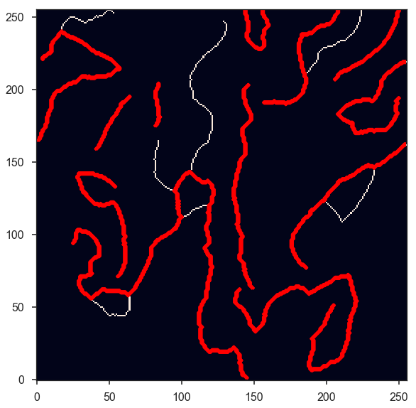

The structure have now been significantly pruned. The red contours
highlight the longest paths through each skeleton.

If we continue to increase the branch threshold, the skeletons will
converge to the longest path structures:

.. code:: python

    fil.analyze_skeletons(branch_thresh=400 * u.pix, prune_criteria='length')

    plt.imshow(fil.skeleton, origin='lower')
    plt.contour(fil.skeleton_longpath, colors='r')

.. parsed-literal::

    <matplotlib.contour.QuadContourSet at 0x7f5472dfa630>

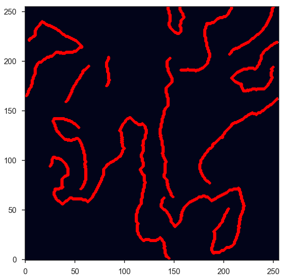

This is an extreme case of pruning and a significant amount of real
structure was removed. We will return to a less pruned version to use
for the rest of the tutorial:

.. code:: python

    fil.medskel(verbose=False)
    fil.analyze_skeletons(branch_thresh=5 * u.pix, prune_criteria='length')

    plt.imshow(fil.skeleton, origin='lower')
    plt.contour(fil.skeleton_longpath, colors='r')

.. parsed-literal::

    <matplotlib.contour.QuadContourSet at 0x7f5472c0a550>

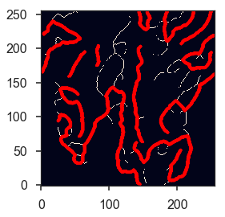

Another new feature of ``FilFinder2D`` is that each filament has its own
analysis class defined in ``fil.filaments``:

.. code:: python

    fil.filaments

.. parsed-literal::

    [<fil_finder.filament.Filament2D at 0x7f5472bf2fd0>,
     <fil_finder.filament.Filament2D at 0x7f5472bf2978>,
     <fil_finder.filament.Filament2D at 0x7f5472c2a710>,
     <fil_finder.filament.Filament2D at 0x7f5472c2a3c8>,
     <fil_finder.filament.Filament2D at 0x7f5472c2a518>,
     <fil_finder.filament.Filament2D at 0x7f5472afce80>,
     <fil_finder.filament.Filament2D at 0x7f5472afce48>,
     <fil_finder.filament.Filament2D at 0x7f5472afcb00>,
     <fil_finder.filament.Filament2D at 0x7f5472afcd30>,
     <fil_finder.filament.Filament2D at 0x7f5472afcba8>,
     <fil_finder.filament.Filament2D at 0x7f5472afccc0>,
     <fil_finder.filament.Filament2D at 0x7f5472f27940>]

This allows for each skeleton to be analyzed independently, in case your
analysis requires fine-tuning.

A separate tutorial on the ``Filament2D`` class is available from the
`docs page <http://fil-finder.readthedocs.io/en/latest/>`__. We will
highlight some of the features here to show the plotting outputs. Each
``Filament2D`` class does not contain that entire image, however, to
avoid making multiple copies of the data.

The first filament is quite large with a lot of structure. We can plot
the output from ``FilFinder2D.analyze_skeletons`` for just one filament
with:

.. code:: python

    fil1 = fil.filaments[0]
    fil1.skeleton_analysis(fil.image, verbose=True, branch_thresh=5 * u.pix, prune_criteria='length')

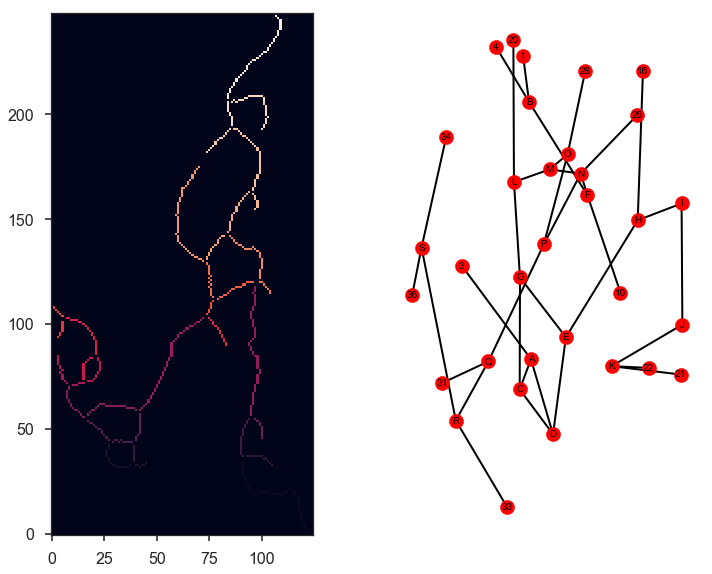

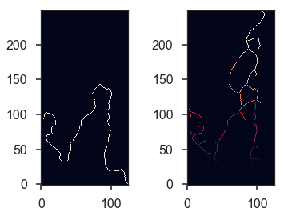

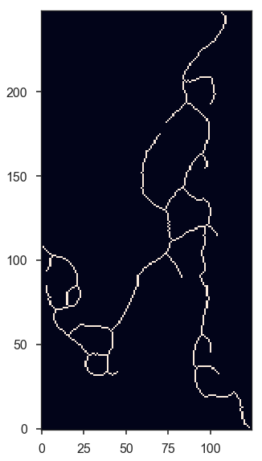

Three plots are returned:

-  The labeled branch array (left) with intersection points removed and
   the equivalent graph structure (right).
-  The longest path through the skeleton (left) and the same labeled
   branch array (right) as above.
-  The final, pruned skeleton structure.

Only one set of plots is shown after the iterative pruning has been
finished.

The lengths of the filament's longest paths are now calculated:

.. code:: python

    fil.lengths()

.. math::

    [453.75945,~270.73506,~159.46804,~127.63961,~156.30866,~138.61017,~46.112698,~165.75231,~32.313708,~115.56854,~72.083261,~65.698485] \; \mathrm{pix}

The default output is in pixel units, but if the angular and physical
scales are defined, they can be converted into other units:

.. code:: python

    fil.lengths(u.deg)

.. math::

    [0.75626575,~0.45122511,~0.26578006,~0.21273268,~0.26051443,~0.23101696,~0.076854497,~0.27625385,~0.053856181,~0.19261424,~0.12013877,~0.10949747] \; \mathrm{{}^{\circ}}

.. code:: python

    fil.lengths(u.pc)

.. math::

    [3.4318251,~2.0475946,~1.2060717,~0.9653503,~1.182177,~1.0483217,~0.34875465,~1.2536002,~0.2443916,~0.87405568,~0.54517244,~0.49688378] \; \mathrm{pc}

The properties of the branches are also saved in the
``FilFinder2D.branch_properties`` dictionary. This includes the length
of each branch, the average intensity, the skeleton pixels of the
branch, and the number of branches in each skeleton:

.. code:: python

    fil.branch_properties.keys()

.. parsed-literal::

    dict_keys(['length', 'intensity', 'pixels', 'number'])

.. code:: python

    fil.branch_properties['number']

.. parsed-literal::

    array([36, 15,  3,  7, 11, 10,  1,  8,  1,  8,  1,  3])

.. code:: python

    fil.branch_properties['length'][0]

.. math::

    [62.284271,~20.485281,~6.2426407,~13.656854,~7,~20.071068,~10.656854,~14.313708,~12.828427,~10.242641,~18.313708,~26.313708,~67.627417,~58.769553,~5.4142136,~15.485281,~15.071068,~12.242641,~25.727922,~16.313708,~7.8284271,~5.6568542,~7.2426407,~20.313708,~19.727922,~7.6568542,~30.970563,~56.112698,~14.899495,~23.142136,~8.2426407,~36.384776,~16.142136,~34.556349,~11.828427,~51.355339] \; \mathrm{pix}

Note that the pixels are defined with respect to the cut-out structures
in ``Filament2D``. These offsets are contained in
``FilFinder2D.filament_extents``. See the ``FilFinder2D`` tutorial for
more information.

The branch lengths can also be returned with:

.. code:: python

    fil.branch_lengths(u.pix)[0]

.. math::

    [62.284271,~20.485281,~6.2426407,~13.656854,~7,~20.071068,~10.656854,~14.313708,~12.828427,~10.242641,~18.313708,~26.313708,~67.627417,~58.769553,~5.4142136,~15.485281,~15.071068,~12.242641,~25.727922,~16.313708,~7.8284271,~5.6568542,~7.2426407,~20.313708,~19.727922,~7.6568542,~30.970563,~56.112698,~14.899495,~23.142136,~8.2426407,~36.384776,~16.142136,~34.556349,~11.828427,~51.355339] \; \mathrm{pix}

.. code:: python

    fil.branch_lengths(u.pc)[0]

.. math::

    [0.47106176,~0.1549321,~0.047213675,~0.10328806,~0.052941654,~0.15179936,~0.080598784,~0.10825591,~0.097022593,~0.077466048,~0.13850829,~0.19901304,~0.51147247,~0.44447962,~0.040948203,~0.11711663,~0.11398389,~0.092592235,~0.19458268,~0.1233821,~0.059207126,~0.042783317,~0.054776768,~0.15363448,~0.14920412,~0.057909504,~0.23423326,~0.42438558,~0.11268627,~0.17502613,~0.062339862,~0.27518146,~0.12208448,~0.2613529,~0.089459499,~0.38840523] \; \mathrm{pc}

Curvature and Orientation
-------------------------

A filament's curvature and orientation are calculated using a modified
version of the `Rolling Hough Transform
(RHT) <http://adsabs.harvard.edu/abs/2014ApJ...789...82C>`__. This can
be run either on the longest path skeletons or on individual branches.

The default setting is to run on the longest path skeletons:

.. code:: python

    fil.exec_rht()
    fil1.plot_rht_distrib()

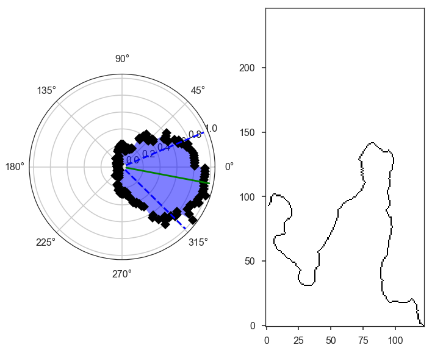

The RHT distribution is shown for the first skeleton, along with its
longest path skeleton. The polar plot shows the distribution as a
function of :math:`2\theta`. Since there is no preferred direction,
:math:`0` and :math:`\pi` are equivalent direction for a filament, and
so the distribution is defined over :math:`\theta \in [-\pi/2, \pi/2)`.
Plotting the distribution as :math:`2\theta` makes it easier to
visualize with discontinuities. The solid green line shows the mean
orientation of the filament, and the curvature region is indicated by
the angle between the dashed blue lines.

The RHT distribution is built by measuring the angular distribution in a
circular region around each pixel in the skeleton, then accumulating the
distribution over all pixels in the skeleton. There are three parameters
that affect the distribution:

-  ``radius`` -- the radius of the circular region to use. The default
   is 10 pixels. The region must be large enough to avoid pixelization
   (causing spikes at 0, 45, and 90 deg) but small enough to only
   include the local filament direction.
-  ``ntheta`` -- The number of bins in :math:`\theta` to calculate the
   distribution at. Default is 180.
-  ``background_percentile`` -- The accumulation process used to create
   the distribution will create a constant background level over
   :math:`\theta`. Peaks in the distribution are better characterized by
   removing this constant level. The default setting is to subtract the
   25th percentile from the distribution.

The RHT returns the orientation and curvature of each filament. The
orientation is defined as the circular mean and the curvature is the
interquartile region about the mean. See the
`documentation <http://fil-finder.readthedocs.io/en/latest/api/fil_finder.FilFinder2D.html#fil_finder.FilFinder2D.exec_rht>`__
for the definitions.

.. code:: python

    fil.orientation

.. math::

    [-0.09372123,~-0.4688631,~0.046228431,~0.47607807,~-0.56841827,~-0.96319154,~-0.57605962,~-1.0046175,~-0.028319612,~-0.41163082,~-0.74576315,~0.12105612] \; \mathrm{rad}

.. code:: python

    fil.curvature

.. math::

    [0.58720166,~0.76920664,~0.50536306,~0.89124894,~0.77025275,~0.73970447,~0.44143597,~1.076277,~0.46711777,~0.73452577,~0.54890669,~0.55313247] \; \mathrm{rad}

It can be more useful to run this analysis on individual branches to
understand the distribution of orientation and curvature across the
whole map. This can be performed by enabling ``branches=True``:

.. code:: python

    fil.exec_rht(branches=True, min_branch_length=5 * u.pix)

There is no default plot setting in this case.

An additional parameter is enabled in this mode: ``min_branch_lengths``.
This avoids running the RHT on very short branches, where pixelization
will lead to large spikes towards the axis directions.

The outputs are contained in ``FilFinder2D.orientation_branches`` and
``FilFinder2D.curvature_branches``, which return a list of lists for
each filament. These can be visualized as distributions:

.. code:: python

    _ = plt.hist(fil.orientation_branches[0].value, bins=10)
    plt.xlabel("Orientation (rad)")

.. parsed-literal::

    Text(0.5,0,'Orientation (rad)')

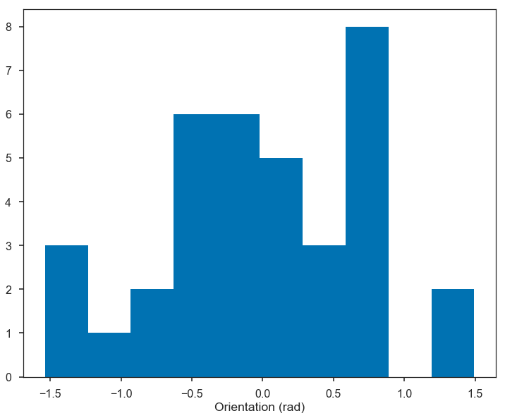

.. code:: python

    all_orient = np.array([orient.value for fil_orient in fil.orientation_branches for orient in fil_orient])
    # Short, excluded branches have NaNs
    all_orient = all_orient[np.isfinite(all_orient)]

    _ = plt.hist(all_orient, bins=10)
    plt.xlabel("Orientation (rad)")

.. parsed-literal::

    Text(0.5,0,'Orientation (rad)')

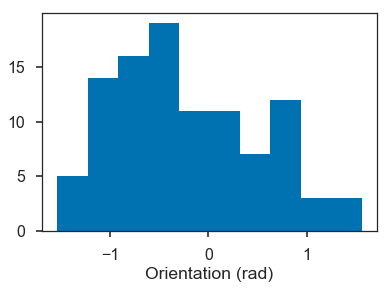

No orientation is strongly preferred in the example data.

Radial Profiles and Widths
--------------------------

``FilFinder2D`` finds filament widths by creating radial profiles
centered on the skeleton. A simple model can then be fit to the radial
profile to find the width.

There are several parameters used to control the creation of the radial
profile:

-  ``max_dist`` -- The maximum radial distance to build the radial
   profile to. Must be given in units of length (pixel, degree, pc,
   etc...). The default is 10 pixels. In order to not bias the fit, the
   profile should extend far enough to adequately fit the background
   level.
-  ``pad_to_distance`` -- FilFinder only includes pixels in the radial
   profiles that are closest to the filament which avoids
   double-counting pixels. But if the filaments are closely packed
   together, this can severely limit the number of points used to make
   the profile. ``pad_to_distance`` forces all pixels within the given
   distance to be included in the profile. Must be given in length units
   and be less than ``max_dist``.
-  ``use_longest_path`` -- Will use the longest path skeleton instead of
   the full skeleton. Default is False.
-  ``kwargs`` -- These are passed to the
   `radial\_profile <https://github.com/e-koch/FilFinder/blob/master/fil_finder/width.py#L365>`__
   function. Please see the documentation in the link for the different
   options. If an error about empty bins or an array with a shape of 0
   is returned, try using ``auto_cut=False``.

FilFinder supports 3 simple models for fitting the radial profiles: a
Gaussian with a mean fixed to 0 and a constant background, the same
Gaussian without a background, and a non-parametric method to estimate
Gaussian widths. However, FilFinder uses the
`astropy.modeling <http://docs.astropy.org/en/stable/modeling/>`__
package and will accept any 1D astropy model. For example, the
`radfil <https://github.com/catherinezucker/radfil>`__ package has an
astropy implementation of a Plummer model, which could be used here.

The parameters that control the fitting are:

-  ``fit_model`` -- The model to the profiles to. The defaults are
   ``gaussian_bkg``, ``gaussian_nobkg``, and ``nonparam``. Otherwise, a
   1D astropy model can be given, as discussed above.
-  ``fitter`` -- The fitter to use. See
   `astropy.modeling.fitter <http://docs.astropy.org/en/stable/modeling/index.html#module-astropy.modeling.fitting>`__.
   Defaults to a least-squares fitter.
-  ``try_nonparam`` -- If the fit to the model fails, the non-parametric
   method can be used instead. Default is True.
-  ``add_width_to_length`` -- The fitted FWHM can be added to the
   lengths (``FilFinder2D.lengths``), assuming that the skeleton's
   length was shortened by the width in the medial axis transform
   (``FilFinder2D.medskel``). The width will not be added if the fit was
   poor or highly unconstrained. Default is True.
-  ``deconvolve_width`` -- Subtract off the beam width when calculating
   the FWHM width. Default is True.
-  ``fwhm_function`` -- Pass a function that takes the ``fit_model`` and
   returns the FWHM and its uncertainty. If None is given, the FWHM is
   passed assuming a Gaussian profile.
-  ``chisq_max`` -- The critical reduced :math:`\chi^2` used to
   determine "bad" fits. The default is 10, and is entirely subjective.
   This seems to flag most bad fits, but the quality of the fits should
   always be visually checked.

With the default settings, a Gaussian with a constant background is fit
to the profiles:

.. code:: python

    fil.find_widths(max_dist=0.2 * u.pc)
    fil1.plot_radial_profile(xunit=u.pc)

.. parsed-literal::

    /home/eric/Dropbox/code_development/filaments/build/lib.linux-x86_64-3.6/fil_finder/filament.py:926: UserWarning: Ignoring adding the width to the length because the fail flag was raised for the fit.
      warnings.warn("Ignoring adding the width to the length because"

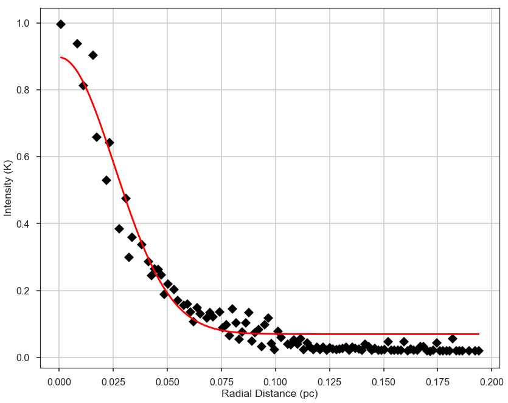

The radial profile of the first filament is shown above. The binned
radial profile is shown as black diamonds and the fit is shown with the
red solid line.

The profile can be plotted with different ``xunit``\ s:

.. code:: python

    fil1.plot_radial_profile(xunit=u.pix)

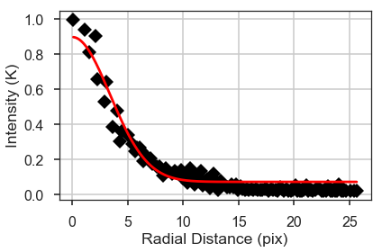

Based on the warning above, at least one of the filament profile fits
failed. We can look at the list of widths. ``FilFinder2D.widths()``
returns the FWHMs and their uncertainties:

.. code:: python

    fil.widths()

.. parsed-literal::

    (<Quantity [ 6.8908461 ,  4.3148627 ,  7.61875285,  5.73253972,  6.89457072,
                 7.01281673, 43.24213164,  5.51177282,  8.63979524,  4.62431374,
                 2.61879647,  5.11334422] pix>,
     <Quantity [ 0.21120144,  0.21981508,  0.25891586,  0.34575726,  0.1521915 ,
                 0.57087374, 56.06296197,  0.18323136,  0.71417106,  0.42027546,
                 0.39571059,  0.23258477] pix>)

These widths can be returned in other units as well:

.. code:: python

    fil.widths(u.pc)

.. parsed-literal::

    (<Quantity [0.05211611, 0.03263371, 0.05762134, 0.04335573, 0.05214428,
                0.05303859, 0.32704428, 0.04168605, 0.06534358, 0.03497412,
                0.0198062 , 0.0386727 ] pc>,
     <Quantity [0.00159734, 0.00166248, 0.0019582 , 0.00261499, 0.00115104,
                0.00431757, 0.42400942, 0.0013858 , 0.00540134, 0.00317858,
                0.0029928 , 0.00175906] pc>)

The 6th filament has a much larger width, and its uncertainty is very
large. We can look at this radial profile more closely:

.. code:: python

    fil.filaments[6].plot_radial_profile(xunit=u.pc)

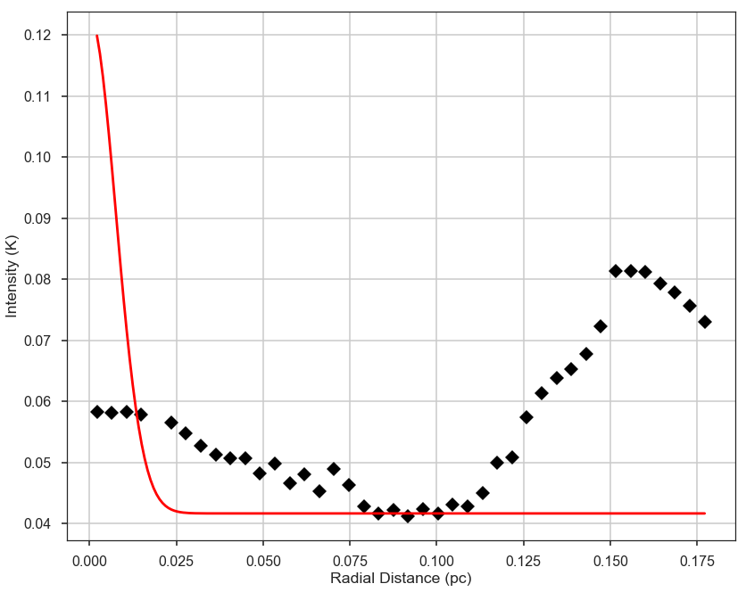

This is a faint feature near another, and the simple modeling has failed
here. This is a case where fine-tuning may lead to a better result for
certain filaments. See the ``Filament2D`` tutorial.

The fit results can be returned as an `astropy
table <http://docs.astropy.org/en/stable/table/>`__:

.. code:: python

    fil.width_fits(xunit=u.pc)

.. parsed-literal::

    WARNING: MergeConflictWarning: In merged column 'amplitude_0' the 'unit' attribute does not match ( != K).  Using K for merged output [astropy.utils.metadata]
    WARNING: MergeConflictWarning: In merged column 'amplitude_0_err' the 'unit' attribute does not match ( != K).  Using K for merged output [astropy.utils.metadata]
    WARNING: MergeConflictWarning: In merged column 'stddev_0' the 'unit' attribute does not match ( != pc).  Using pc for merged output [astropy.utils.metadata]
    WARNING: MergeConflictWarning: In merged column 'stddev_0_err' the 'unit' attribute does not match ( != pc).  Using pc for merged output [astropy.utils.metadata]
    WARNING: MergeConflictWarning: In merged column 'amplitude_1' the 'unit' attribute does not match ( != K).  Using K for merged output [astropy.utils.metadata]
    WARNING: MergeConflictWarning: In merged column 'amplitude_1_err' the 'unit' attribute does not match ( != K).  Using K for merged output [astropy.utils.metadata]
    WARNING: MergeConflictWarning: In merged column 'amplitude_0' the 'unit' attribute does not match (K != ).  Using  for merged output [astropy.utils.metadata]
    WARNING: MergeConflictWarning: In merged column 'amplitude_0_err' the 'unit' attribute does not match (K != ).  Using  for merged output [astropy.utils.metadata]
    WARNING: MergeConflictWarning: In merged column 'stddev_0' the 'unit' attribute does not match (pc != ).  Using  for merged output [astropy.utils.metadata]
    WARNING: MergeConflictWarning: In merged column 'stddev_0_err' the 'unit' attribute does not match (pc != ).  Using  for merged output [astropy.utils.metadata]
    WARNING: MergeConflictWarning: In merged column 'amplitude_1' the 'unit' attribute does not match (K != ).  Using  for merged output [astropy.utils.metadata]
    WARNING: MergeConflictWarning: In merged column 'amplitude_1_err' the 'unit' attribute does not match (K != ).  Using  for merged output [astropy.utils.metadata]

.. raw:: html

    <i>Table length=12</i>
    <table id="table140000708124064" class="table-striped table-bordered table-condensed">
    <thead><tr><th>amplitude_0</th><th>amplitude_0_err</th><th>stddev_0</th><th>stddev_0_err</th><th>amplitude_1</th><th>amplitude_1_err</th><th>fwhm</th><th>fwhm_err</th><th>fail_flag</th><th>model_type</th></tr></thead>
    <thead><tr><th></th><th></th><th></th><th></th><th></th><th></th><th>pc</th><th>pc</th><th></th><th></th></tr></thead>
    <thead><tr><th>float64</th><th>float64</th><th>float64</th><th>float64</th><th>float64</th><th>float64</th><th>float64</th><th>float64</th><th>bool</th><th>str12</th></tr></thead>
    <tr><td>0.8266318642985881</td><td>0.021908564156604842</td><td>3.3835577748381396</td><td>0.07756760622361797</td><td>0.07000301037057191</td><td>0.0066838356612052875</td><td>0.052116112847711886</td><td>0.0015973362521571198</td><td>False</td><td>gaussian_bkg</td></tr>
    <tr><td>1.610889141321533</td><td>0.05823998765210095</td><td>2.498581466936979</td><td>0.0684566283485164</td><td>0.10149694602325535</td><td>0.011292916525371517</td><td>0.03263370969939996</td><td>0.0016624820013050273</td><td>False</td><td>gaussian_bkg</td></tr>
    <tr><td>0.8867464296160771</td><td>0.031793809834588294</td><td>3.6541914982443844</td><td>0.09734996214533265</td><td>0.1558602055832551</td><td>0.00785018512868218</td><td>0.05762133955387579</td><td>0.001958204832120392</td><td>False</td><td>gaussian_bkg</td></tr>
    <tr><td>0.6715148511637843</td><td>0.032901580538658826</td><td>2.968437758937908</td><td>0.12041344744531615</td><td>0.1174774330284996</td><td>0.009160806938584936</td><td>0.04335573344311829</td><td>0.0026149944928117643</td><td>False</td><td>gaussian_bkg</td></tr>
    <tr><td>0.4353429538973092</td><td>0.009204276481418352</td><td>3.3849258021981505</td><td>0.05590272982997455</td><td>0.02526366665910463</td><td>0.0022355344064575295</td><td>0.05214428247972733</td><td>0.0011510385041146299</td><td>False</td><td>gaussian_bkg</td></tr>
    <tr><td>0.13653513247619764</td><td>0.008853443143977605</td><td>3.4284523403458675</td><td>0.21058090555591993</td><td>0.04690377151911184</td><td>0.0038059534077885884</td><td>0.053038588139601446</td><td>0.004317571408578928</td><td>False</td><td>gaussian_bkg</td></tr>
    <tr><td>0.08139836490154266</td><td>0.016841093078255653</td><td>0.13947584235216182</td><td>0.17929477062975646</td><td>0.04166540503501892</td><td>0.0183346439152956</td><td>0.3270442815271493</td><td>0.4240094190495937</td><td>True</td><td>nonparam</td></tr>
    <tr><td>0.21357591588327188</td><td>0.005301560204550227</td><td>2.89205108873655</td><td>0.0629752233735968</td><td>0.05620741989680834</td><td>0.0013182403481251076</td><td>0.04168605274044444</td><td>0.0013857959315123815</td><td>False</td><td>gaussian_bkg</td></tr>
    <tr><td>1.7292936362939049</td><td>0.16886579339497365</td><td>4.0431210697068884</td><td>0.27521588902838573</td><td>-0.010528218993459898</td><td>0.033082124518902876</td><td>0.06534357859370385</td><td>0.005401342450237702</td><td>False</td><td>gaussian_bkg</td></tr>
    <tr><td>1.6067353590457791</td><td>0.09476125935685616</td><td>2.596490706619731</td><td>0.1349830078341973</td><td>0.20945758183542568</td><td>0.03207949945389873</td><td>0.034974116881036445</td><td>0.003178582552243453</td><td>False</td><td>gaussian_bkg</td></tr>
    <tr><td>0.03892922006803144</td><td>0.0028615655670046715</td><td>2.030309712573202</td><td>0.09204531211727611</td><td>0.029055098584967392</td><td>0.00033216917564048653</td><td>0.019806202366241643</td><td>0.002992796127670664</td><td>False</td><td>gaussian_bkg</td></tr>
    <tr><td>2.544740855958763</td><td>0.08294821284997458</td><td>2.7569059276825842</td><td>0.07779450314303882</td><td>0.22128380631722383</td><td>0.031851617462379564</td><td>0.038672700082474525</td><td>0.001759060359710792</td><td>False</td><td>gaussian_bkg</td></tr>
    </table>

This provides the fit results, the parameter errors, whether or not the
fit failed, and the type of model used. The table can then be saved.

Other Filament Properties
-------------------------

With the width models, we can define other filament properties, such as
the total intensity within the FWHM of the filament:

.. code:: python

    fil.total_intensity()

.. math::

    [7133.1509,~3538.8506,~1187.0249,~853.59998,~824.00342,~350.38428,~98.006683,~359.08759,~400.62476,~2129.0601,~11.555851,~1204.0597] \; \mathrm{K}

If a background was fit in the model, the background level can be
subtracted off. The index of the background parameter needs to be given.
For the ''gaussian\_bkg'', this is ``bkg_mod_index=2`` and set as the
default:

.. code:: python

    fil.total_intensity(bkg_subtract=True)

.. math::

    [6738.7539,~3378.1809,~990.95276,~738.23712,~782.19208,~266.42651,~21.717327,~291.18903,~404.1517,~1898.6567,~6.3840432,~1115.9888] \; \mathrm{K}

The median brightness along the skeleton is calculated with:

.. code:: python

    fil.median_brightness()

.. parsed-literal::

    array([0.995523  , 2.0136652 , 1.088453  , 0.8972937 , 0.503168  ,
           0.1784499 , 0.05824468, 0.27832663, 0.9761157 , 1.8300676 ,
           0.06206793, 3.0347648 ], dtype=float32)

Based on the radial profile models, we can create an image based on the
models:

.. code:: python

    fil_mod = fil.filament_model()
    plt.imshow(fil_mod)
    plt.colorbar()

.. parsed-literal::

    <matplotlib.colorbar.Colorbar at 0x7f5472e73400>

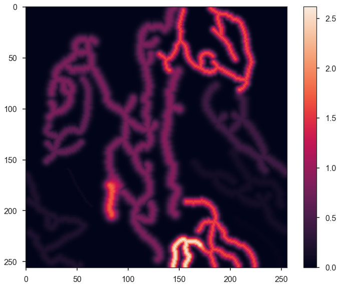

By default, the background level is subtracted off, as was used for
``fil.total_intensity``. The maximum radius around each skeleton to
evaluate the model can also be given with ``max_radius``. The default is
3 times the FWHM, which should account for most of the model flux.

This model can be used to estimate the fraction of the total flux
contained in the filamentary structure:

.. code:: python

    fil.covering_fraction()

.. parsed-literal::

    0.5562639744273953

The same keywords given to ``FilFinder2D.filament_model`` can be passed
here.

The values aligned along the longest path are returned with:

.. code:: python

    profs = fil.ridge_profiles()
    plt.subplot(211)
    plt.plot(profs[0])
    plt.subplot(212)
    plt.plot(profs[1])
    plt.tight_layout()

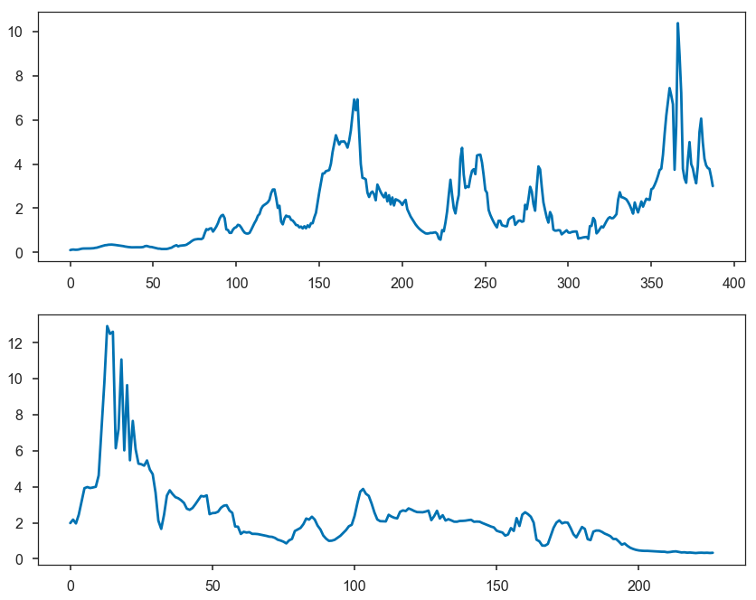

This can be useful for examining the distribution of cores along
filaments.

Output Table & Images
---------------------

``FilFinder2D`` returns result tables as `astropy
tables <http://docs.astropy.org/en/stable/table/>`__.
``FilFinder2D.width_fits`` is highlighted above.

The width results and additional properties are returned with:

.. code:: python

    fil.output_table(xunit=u.pc)

.. parsed-literal::

    WARNING: MergeConflictWarning: In merged column 'amplitude_0' the 'unit' attribute does not match ( != K).  Using K for merged output [astropy.utils.metadata]
    WARNING: MergeConflictWarning: In merged column 'amplitude_0_err' the 'unit' attribute does not match ( != K).  Using K for merged output [astropy.utils.metadata]
    WARNING: MergeConflictWarning: In merged column 'stddev_0' the 'unit' attribute does not match ( != pc).  Using pc for merged output [astropy.utils.metadata]
    WARNING: MergeConflictWarning: In merged column 'stddev_0_err' the 'unit' attribute does not match ( != pc).  Using pc for merged output [astropy.utils.metadata]
    WARNING: MergeConflictWarning: In merged column 'amplitude_1' the 'unit' attribute does not match ( != K).  Using K for merged output [astropy.utils.metadata]
    WARNING: MergeConflictWarning: In merged column 'amplitude_1_err' the 'unit' attribute does not match ( != K).  Using K for merged output [astropy.utils.metadata]
    WARNING: MergeConflictWarning: In merged column 'amplitude_0' the 'unit' attribute does not match (K != ).  Using  for merged output [astropy.utils.metadata]
    WARNING: MergeConflictWarning: In merged column 'amplitude_0_err' the 'unit' attribute does not match (K != ).  Using  for merged output [astropy.utils.metadata]
    WARNING: MergeConflictWarning: In merged column 'stddev_0' the 'unit' attribute does not match (pc != ).  Using  for merged output [astropy.utils.metadata]
    WARNING: MergeConflictWarning: In merged column 'stddev_0_err' the 'unit' attribute does not match (pc != ).  Using  for merged output [astropy.utils.metadata]
    WARNING: MergeConflictWarning: In merged column 'amplitude_1' the 'unit' attribute does not match (K != ).  Using  for merged output [astropy.utils.metadata]
    WARNING: MergeConflictWarning: In merged column 'amplitude_1_err' the 'unit' attribute does not match (K != ).  Using  for merged output [astropy.utils.metadata]

.. raw:: html

    <i>Table length=12</i>
    <table id="table140000669213192" class="table-striped table-bordered table-condensed">
    <thead><tr><th>lengths</th><th>branches</th><th>total_intensity</th><th>median_brightness</th><th>X_posn</th><th>Y_posn</th><th>amplitude_0</th><th>amplitude_0_err</th><th>stddev_0</th><th>stddev_0_err</th><th>amplitude_1</th><th>amplitude_1_err</th><th>fwhm</th><th>fwhm_err</th><th>fail_flag</th><th>model_type</th></tr></thead>
    <thead><tr><th>pc</th><th></th><th>K</th><th></th><th>pix</th><th>pix</th><th></th><th></th><th></th><th></th><th></th><th></th><th>pc</th><th>pc</th><th></th><th></th></tr></thead>
    <thead><tr><th>float64</th><th>int64</th><th>float64</th><th>float32</th><th>float64</th><th>float64</th><th>float64</th><th>float64</th><th>float64</th><th>float64</th><th>float64</th><th>float64</th><th>float64</th><th>float64</th><th>bool</th><th>str12</th></tr></thead>
    <tr><td>3.4839412361229956</td><td>36</td><td>7133.15087890625</td><td>0.995523</td><td>106.0</td><td>95.5</td><td>0.8266318642985881</td><td>0.021908564156604842</td><td>3.3835577748381396</td><td>0.07756760622361797</td><td>0.07000301037057191</td><td>0.0066838356612052875</td><td>0.052116112847711886</td><td>0.0015973362521571198</td><td>False</td><td>gaussian_bkg</td></tr>
    <tr><td>2.080228297847961</td><td>15</td><td>3538.8505859375</td><td>2.0136652</td><td>188.0</td><td>45.0</td><td>1.610889141321533</td><td>0.05823998765210095</td><td>2.498581466936979</td><td>0.0684566283485164</td><td>0.10149694602325535</td><td>0.011292916525371517</td><td>0.03263370969939996</td><td>0.0016624820013050273</td><td>False</td><td>gaussian_bkg</td></tr>
    <tr><td>1.2636930050233348</td><td>3</td><td>1187.02490234375</td><td>1.088453</td><td>142.0</td><td>126.5</td><td>0.8867464296160771</td><td>0.031793809834588294</td><td>3.6541914982443844</td><td>0.09734996214533265</td><td>0.1558602055832551</td><td>0.00785018512868218</td><td>0.05762133955387579</td><td>0.001958204832120392</td><td>False</td><td>gaussian_bkg</td></tr>
    <tr><td>1.0087060309826756</td><td>7</td><td>853.5999755859375</td><td>0.8972937</td><td>43.0</td><td>123.0</td><td>0.6715148511637843</td><td>0.032901580538658826</td><td>2.968437758937908</td><td>0.12041344744531615</td><td>0.1174774330284996</td><td>0.009160806938584936</td><td>0.04335573344311829</td><td>0.0026149944928117643</td><td>False</td><td>gaussian_bkg</td></tr>
    <tr><td>1.2343212651217559</td><td>11</td><td>824.00341796875</td><td>0.503168</td><td>213.0</td><td>120.5</td><td>0.4353429538973092</td><td>0.009204276481418352</td><td>3.3849258021981505</td><td>0.05590272982997455</td><td>0.02526366665910463</td><td>0.0022355344064575295</td><td>0.05214428247972733</td><td>0.0011510385041146299</td><td>False</td><td>gaussian_bkg</td></tr>
    <tr><td>1.101360276675763</td><td>10</td><td>350.38427734375</td><td>0.1784499</td><td>218.0</td><td>178.0</td><td>0.13653513247619764</td><td>0.008853443143977605</td><td>3.4284523403458675</td><td>0.21058090555591993</td><td>0.04690377151911184</td><td>0.0038059534077885884</td><td>0.053038588139601446</td><td>0.004317571408578928</td><td>False</td><td>gaussian_bkg</td></tr>
    <tr><td>0.3487546458890681</td><td>1</td><td>98.00668334960938</td><td>0.05824468</td><td>51.0</td><td>177.5</td><td>0.08139836490154266</td><td>0.016841093078255653</td><td>0.13947584235216182</td><td>0.17929477062975646</td><td>0.04166540503501892</td><td>0.0183346439152956</td><td>0.3270442815271493</td><td>0.4240094190495937</td><td>True</td><td>nonparam</td></tr>
    <tr><td>1.29528624876539</td><td>8</td><td>359.08758544921875</td><td>0.27832663</td><td>23.0</td><td>216.0</td><td>0.21357591588327188</td><td>0.005301560204550227</td><td>2.89205108873655</td><td>0.0629752233735968</td><td>0.05620741989680834</td><td>0.0013182403481251076</td><td>0.04168605274044444</td><td>0.0013857959315123815</td><td>False</td><td>gaussian_bkg</td></tr>
    <tr><td>0.30973517489460717</td><td>1</td><td>400.624755859375</td><td>0.9761157</td><td>83.0</td><td>189.5</td><td>1.7292936362939049</td><td>0.16886579339497365</td><td>4.0431210697068884</td><td>0.27521588902838573</td><td>-0.010528218993459898</td><td>0.033082124518902876</td><td>0.06534357859370385</td><td>0.005401342450237702</td><td>False</td><td>gaussian_bkg</td></tr>
    <tr><td>0.909029800814392</td><td>8</td><td>2129.06005859375</td><td>1.8300676</td><td>185.0</td><td>229.0</td><td>1.6067353590457791</td><td>0.09476125935685616</td><td>2.596490706619731</td><td>0.1349830078341973</td><td>0.20945758183542568</td><td>0.03207949945389873</td><td>0.034974116881036445</td><td>0.003178582552243453</td><td>False</td><td>gaussian_bkg</td></tr>
    <tr><td>0.5649786406338143</td><td>1</td><td>11.555850982666016</td><td>0.06206793</td><td>234.0</td><td>227.0</td><td>0.03892922006803144</td><td>0.0028615655670046715</td><td>2.030309712573202</td><td>0.09204531211727611</td><td>0.029055098584967392</td><td>0.00033216917564048653</td><td>0.019806202366241643</td><td>0.002992796127670664</td><td>False</td><td>gaussian_bkg</td></tr>
    <tr><td>0.5355564786104228</td><td>3</td><td>1204.0596923828125</td><td>3.0347648</td><td>156.0</td><td>238.0</td><td>2.544740855958763</td><td>0.08294821284997458</td><td>2.7569059276825842</td><td>0.07779450314303882</td><td>0.22128380631722383</td><td>0.031851617462379564</td><td>0.038672700082474525</td><td>0.001759060359710792</td><td>False</td><td>gaussian_bkg</td></tr>
    </table>

This will include units if attached to the image or radial profile
models.

The median positions can also be returned in world coordinates if WCS
information was given:

.. code:: python

    fil.output_table(xunit=u.pc, world_coord=True)

.. parsed-literal::

    WARNING: MergeConflictWarning: In merged column 'amplitude_0' the 'unit' attribute does not match ( != K).  Using K for merged output [astropy.utils.metadata]
    WARNING: MergeConflictWarning: In merged column 'amplitude_0_err' the 'unit' attribute does not match ( != K).  Using K for merged output [astropy.utils.metadata]
    WARNING: MergeConflictWarning: In merged column 'stddev_0' the 'unit' attribute does not match ( != pc).  Using pc for merged output [astropy.utils.metadata]
    WARNING: MergeConflictWarning: In merged column 'stddev_0_err' the 'unit' attribute does not match ( != pc).  Using pc for merged output [astropy.utils.metadata]
    WARNING: MergeConflictWarning: In merged column 'amplitude_1' the 'unit' attribute does not match ( != K).  Using K for merged output [astropy.utils.metadata]
    WARNING: MergeConflictWarning: In merged column 'amplitude_1_err' the 'unit' attribute does not match ( != K).  Using K for merged output [astropy.utils.metadata]
    WARNING: MergeConflictWarning: In merged column 'amplitude_0' the 'unit' attribute does not match (K != ).  Using  for merged output [astropy.utils.metadata]
    WARNING: MergeConflictWarning: In merged column 'amplitude_0_err' the 'unit' attribute does not match (K != ).  Using  for merged output [astropy.utils.metadata]
    WARNING: MergeConflictWarning: In merged column 'stddev_0' the 'unit' attribute does not match (pc != ).  Using  for merged output [astropy.utils.metadata]
    WARNING: MergeConflictWarning: In merged column 'stddev_0_err' the 'unit' attribute does not match (pc != ).  Using  for merged output [astropy.utils.metadata]
    WARNING: MergeConflictWarning: In merged column 'amplitude_1' the 'unit' attribute does not match (K != ).  Using  for merged output [astropy.utils.metadata]
    WARNING: MergeConflictWarning: In merged column 'amplitude_1_err' the 'unit' attribute does not match (K != ).  Using  for merged output [astropy.utils.metadata]

.. raw:: html

    <i>Table length=12</i>
    <table id="table140000669666328" class="table-striped table-bordered table-condensed">
    <thead><tr><th>lengths</th><th>branches</th><th>total_intensity</th><th>median_brightness</th><th>RA</th><th>Dec</th><th>amplitude_0</th><th>amplitude_0_err</th><th>stddev_0</th><th>stddev_0_err</th><th>amplitude_1</th><th>amplitude_1_err</th><th>fwhm</th><th>fwhm_err</th><th>fail_flag</th><th>model_type</th></tr></thead>
    <thead><tr><th>pc</th><th></th><th>K</th><th></th><th>deg</th><th>deg</th><th></th><th></th><th></th><th></th><th></th><th></th><th>pc</th><th>pc</th><th></th><th></th></tr></thead>
    <thead><tr><th>float64</th><th>int64</th><th>float64</th><th>float32</th><th>float64</th><th>float64</th><th>float64</th><th>float64</th><th>float64</th><th>float64</th><th>float64</th><th>float64</th><th>float64</th><th>float64</th><th>bool</th><th>str12</th></tr></thead>
    <tr><td>3.4839412361229956</td><td>36</td><td>7133.15087890625</td><td>0.995523</td><td>0.05250000000105</td><td>-0.0350000000007</td><td>0.8266318642985881</td><td>0.021908564156604842</td><td>3.3835577748381396</td><td>0.07756760622361797</td><td>0.07000301037057191</td><td>0.0066838356612052875</td><td>0.052116112847711886</td><td>0.0015973362521571198</td><td>False</td><td>gaussian_bkg</td></tr>
    <tr><td>2.080228297847961</td><td>15</td><td>3538.8505859375</td><td>2.0136652</td><td>0.1366666666694</td><td>0.1016666666687</td><td>1.610889141321533</td><td>0.05823998765210095</td><td>2.498581466936979</td><td>0.0684566283485164</td><td>0.10149694602325535</td><td>0.011292916525371517</td><td>0.03263370969939996</td><td>0.0016624820013050273</td><td>False</td><td>gaussian_bkg</td></tr>
    <tr><td>1.2636930050233348</td><td>3</td><td>1187.02490234375</td><td>1.088453</td><td>0.00083333333335</td><td>0.025000000000499997</td><td>0.8867464296160771</td><td>0.031793809834588294</td><td>3.6541914982443844</td><td>0.09734996214533265</td><td>0.1558602055832551</td><td>0.00785018512868218</td><td>0.05762133955387579</td><td>0.001958204832120392</td><td>False</td><td>gaussian_bkg</td></tr>
    <tr><td>1.0087060309826756</td><td>7</td><td>853.5999755859375</td><td>0.8972937</td><td>0.0066666666668</td><td>-0.1400000000028</td><td>0.6715148511637843</td><td>0.032901580538658826</td><td>2.968437758937908</td><td>0.12041344744531615</td><td>0.1174774330284996</td><td>0.009160806938584936</td><td>0.04335573344311829</td><td>0.0026149944928117643</td><td>False</td><td>gaussian_bkg</td></tr>
    <tr><td>1.2343212651217559</td><td>11</td><td>824.00341796875</td><td>0.503168</td><td>0.010833333333549999</td><td>0.1433333333362</td><td>0.4353429538973092</td><td>0.009204276481418352</td><td>3.3849258021981505</td><td>0.05590272982997455</td><td>0.02526366665910463</td><td>0.0022355344064575295</td><td>0.05214428247972733</td><td>0.0011510385041146299</td><td>False</td><td>gaussian_bkg</td></tr>
    <tr><td>1.101360276675763</td><td>10</td><td>350.38427734375</td><td>0.1784499</td><td>359.9149999999983</td><td>0.1516666666697</td><td>0.13653513247619764</td><td>0.008853443143977605</td><td>3.4284523403458675</td><td>0.21058090555591993</td><td>0.04690377151911184</td><td>0.0038059534077885884</td><td>0.053038588139601446</td><td>0.004317571408578928</td><td>False</td><td>gaussian_bkg</td></tr>
    <tr><td>0.3487546458890681</td><td>1</td><td>98.00668334960938</td><td>0.05824468</td><td>359.91583333333165</td><td>-0.12666666666919998</td><td>0.08139836490154266</td><td>0.016841093078255653</td><td>0.13947584235216182</td><td>0.17929477062975646</td><td>0.04166540503501892</td><td>0.0183346439152956</td><td>0.3270442815271493</td><td>0.4240094190495937</td><td>True</td><td>nonparam</td></tr>
    <tr><td>1.29528624876539</td><td>8</td><td>359.08758544921875</td><td>0.27832663</td><td>359.8516666666637</td><td>-0.17333333333679998</td><td>0.21357591588327188</td><td>0.005301560204550227</td><td>2.89205108873655</td><td>0.0629752233735968</td><td>0.05620741989680834</td><td>0.0013182403481251076</td><td>0.04168605274044444</td><td>0.0013857959315123815</td><td>False</td><td>gaussian_bkg</td></tr>
    <tr><td>0.30973517489460717</td><td>1</td><td>400.624755859375</td><td>0.9761157</td><td>359.89583333333127</td><td>-0.0733333333348</td><td>1.7292936362939049</td><td>0.16886579339497365</td><td>4.0431210697068884</td><td>0.27521588902838573</td><td>-0.010528218993459898</td><td>0.033082124518902876</td><td>0.06534357859370385</td><td>0.005401342450237702</td><td>False</td><td>gaussian_bkg</td></tr>
    <tr><td>0.909029800814392</td><td>8</td><td>2129.06005859375</td><td>1.8300676</td><td>359.8299999999966</td><td>0.0966666666686</td><td>1.6067353590457791</td><td>0.09476125935685616</td><td>2.596490706619731</td><td>0.1349830078341973</td><td>0.20945758183542568</td><td>0.03207949945389873</td><td>0.034974116881036445</td><td>0.003178582552243453</td><td>False</td><td>gaussian_bkg</td></tr>
    <tr><td>0.5649786406338143</td><td>1</td><td>11.555850982666016</td><td>0.06206793</td><td>359.83333333333</td><td>0.1783333333369</td><td>0.03892922006803144</td><td>0.0028615655670046715</td><td>2.030309712573202</td><td>0.09204531211727611</td><td>0.029055098584967392</td><td>0.00033216917564048653</td><td>0.019806202366241643</td><td>0.002992796127670664</td><td>False</td><td>gaussian_bkg</td></tr>
    <tr><td>0.5355564786104228</td><td>3</td><td>1204.0596923828125</td><td>3.0347648</td><td>359.8149999999963</td><td>0.0483333333343</td><td>2.544740855958763</td><td>0.08294821284997458</td><td>2.7569059276825842</td><td>0.07779450314303882</td><td>0.22128380631722383</td><td>0.031851617462379564</td><td>0.038672700082474525</td><td>0.001759060359710792</td><td>False</td><td>gaussian_bkg</td></tr>
    </table>

A table for each of the branch properties of the filaments is returned
with:

.. code:: python

    branch_tables = fil.branch_tables()
    branch_tables[0]

.. raw:: html

    <i>Table length=36</i>
    <table id="table140000669705160" class="table-striped table-bordered table-condensed">
    <thead><tr><th>length</th><th>intensity</th></tr></thead>
    <thead><tr><th>pix</th><th></th></tr></thead>
    <thead><tr><th>float64</th><th>float32</th></tr></thead>
    <tr><td>62.2842712474619</td><td>3.9204443</td></tr>
    <tr><td>20.48528137423857</td><td>1.1869783</td></tr>
    <tr><td>6.242640687119286</td><td>0.59490615</td></tr>
    <tr><td>13.65685424949238</td><td>5.536005</td></tr>
    <tr><td>7.0</td><td>0.9801212</td></tr>
    <tr><td>20.071067811865476</td><td>1.3630383</td></tr>
    <tr><td>10.65685424949238</td><td>1.0734288</td></tr>
    <tr><td>14.313708498984761</td><td>0.56572586</td></tr>
    <tr><td>12.82842712474619</td><td>2.260275</td></tr>
    <tr><td>...</td><td>...</td></tr>
    <tr><td>30.970562748477143</td><td>2.326289</td></tr>
    <tr><td>56.112698372208094</td><td>0.77015895</td></tr>
    <tr><td>14.899494936611667</td><td>1.2642363</td></tr>
    <tr><td>23.14213562373095</td><td>0.95123225</td></tr>
    <tr><td>8.242640687119286</td><td>0.5127995</td></tr>
    <tr><td>36.384776310850235</td><td>0.7552973</td></tr>
    <tr><td>16.14213562373095</td><td>0.45914</td></tr>
    <tr><td>34.55634918610404</td><td>0.34504774</td></tr>
    <tr><td>11.82842712474619</td><td>0.3573772</td></tr>
    <tr><td>51.35533905932738</td><td>0.3015641</td></tr>
    </table>

If the RHT was run on branches, these data can also be added to the
branch tables:

.. code:: python

    branch_tables = fil.branch_tables(include_rht=True)
    branch_tables[0]

.. raw:: html

    <i>Table length=36</i>
    <table id="table140000669141424" class="table-striped table-bordered table-condensed">
    <thead><tr><th>length</th><th>intensity</th><th>orientation</th><th>curvature</th></tr></thead>
    <thead><tr><th>pix</th><th></th><th>rad</th><th>rad</th></tr></thead>
    <thead><tr><th>float64</th><th>float32</th><th>float64</th><th>float64</th></tr></thead>
    <tr><td>62.2842712474619</td><td>3.9204443</td><td>0.6605986359911616</td><td>0.9210741882576339</td></tr>
    <tr><td>20.48528137423857</td><td>1.1869783</td><td>0.8013749893786044</td><td>0.923494292293757</td></tr>
    <tr><td>6.242640687119286</td><td>0.59490615</td><td>-1.3508316009050338</td><td>0.43948899090739646</td></tr>
    <tr><td>13.65685424949238</td><td>5.536005</td><td>1.2752124061527075</td><td>0.5512162614209193</td></tr>
    <tr><td>7.0</td><td>0.9801212</td><td>-1.217704747523665e-16</td><td>0.320209242394435</td></tr>
    <tr><td>20.071067811865476</td><td>1.3630383</td><td>-0.19871906195057346</td><td>0.468575647829656</td></tr>
    <tr><td>10.65685424949238</td><td>1.0734288</td><td>1.4946357727743391</td><td>0.3891476232440563</td></tr>
    <tr><td>14.313708498984761</td><td>0.56572586</td><td>0.8255987161778524</td><td>0.46475729202323324</td></tr>
    <tr><td>12.82842712474619</td><td>2.260275</td><td>-0.15669231901614641</td><td>0.47639931090836724</td></tr>
    <tr><td>...</td><td>...</td><td>...</td><td>...</td></tr>
    <tr><td>30.970562748477143</td><td>2.326289</td><td>0.630206751601683</td><td>0.8559321180406212</td></tr>
    <tr><td>56.112698372208094</td><td>0.77015895</td><td>-0.08470445045526162</td><td>0.7149396089534249</td></tr>
    <tr><td>14.899494936611667</td><td>1.2642363</td><td>-0.6374341224741409</td><td>0.44963034275443436</td></tr>
    <tr><td>23.14213562373095</td><td>0.95123225</td><td>-0.4749003366423377</td><td>0.5011542068110733</td></tr>
    <tr><td>8.242640687119286</td><td>0.5127995</td><td>0.2138466579758032</td><td>0.45210663309611</td></tr>
    <tr><td>36.384776310850235</td><td>0.7552973</td><td>0.2078563216866202</td><td>0.7597649003949792</td></tr>
    <tr><td>16.14213562373095</td><td>0.45914</td><td>-0.7826663615765113</td><td>0.4520951862182143</td></tr>
    <tr><td>34.55634918610404</td><td>0.34504774</td><td>-0.3671502635739899</td><td>1.4416318768939498</td></tr>
    <tr><td>11.82842712474619</td><td>0.3573772</td><td>0.2536436249644679</td><td>0.45310231131019507</td></tr>
    <tr><td>51.35533905932738</td><td>0.3015641</td><td>-0.6066606952256631</td><td>0.532684628103508</td></tr>
    </table>

These tables can be saved to a format supported by `astropy
tables <http://docs.astropy.org/en/stable/table/io.html>`__.

Finally, the mask, skeletons, longest path skeletons, and the filament
model can be saved as a FITS file:

.. code:: python

    fil.save_fits()

This will save the file with prefix given at the beginning. This can be
changed by specifying ``save_name`` here. The keywords for
``FilFinder2D.filament_model`` can also be specified here.

The regions and stamps around each filament can also be saved with:

.. code:: python

    fil.save_stamp_fits()

The same arguments for ``FilFinder2D.save_fits`` can be given, along
with ``pad_size`` which sets how large of an area around each skeleton
is included in the stamp. This will create a FITS file for each
filament.
